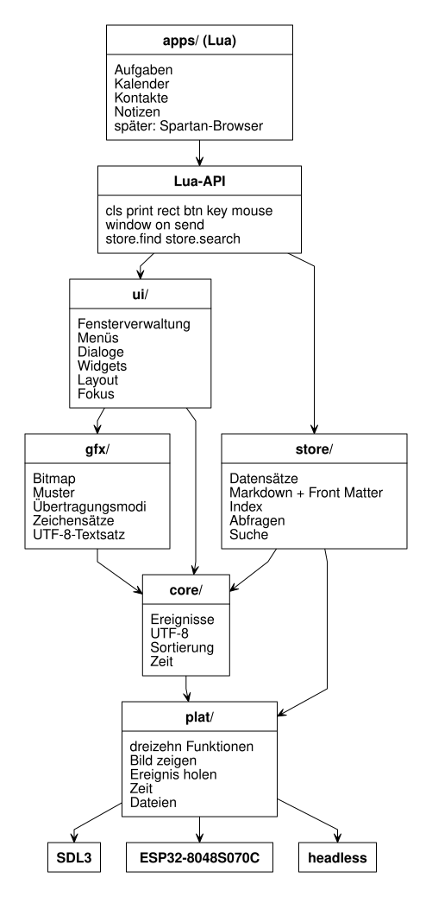
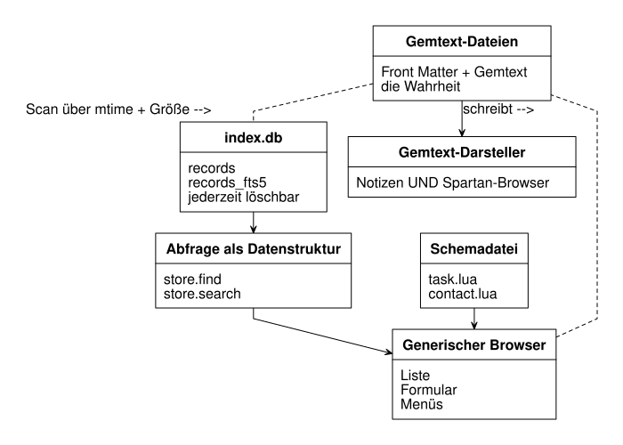
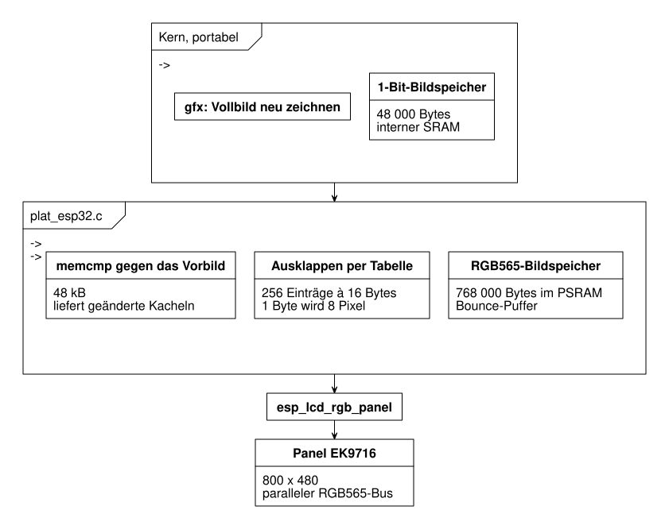

# PDA — Systementwurf

Ein PalmOS-inspiriertes PIM-Paket (Aufgaben, Kalender, Kontakte, Notizen) mit der
Optik von Macintosh System 1, einer Picotron-artigen API, Markdown+SQLite als
Speicher und Lua als Erweiterungssprache.

**Status:** Entwurf, noch kein Code. Dieses Dokument ist die Referenz für die
Umsetzung; [ROADMAP.md](ROADMAP.md) zerlegt sie in Kurskapitel. Diagrammquellen
liegen als Nomnoml in [docs/diagramme/](docs/diagramme/).

---

## 0. Leitplanken

Fünf Regeln begründen jede Detailentscheidung. Die Nummerierung ist eine
Rangfolge: bei Zweifeln gewinnt die weiter oben stehende Regel.

1. **Einfach, nicht clever.** Wenn eine Lösung mit 20 Zeilen 95 % so gut ist wie
   eine mit 200, nimm die 20. Optimierungen brauchen eine Messung als
   Begründung, keine Vermutung.
2. **Datengetrieben.** Wer eine Aufgabenliste um ein Feld erweitert, schreibt
   eine Datenzeile, keinen Code. Schemata, Menüs, Tastenbelegungen, Zeichensätze,
   Übersetzungen, Testskripte: alles sind Dateien, die das Programm liest.
3. **Generisch.** Aufgaben, Termine, Kontakte und Notizen sind dasselbe:
   Sammlungen von Datensätzen mit Feldern. Also gibt es *eine* Anwendung, die von
   vier Schemadateien gesteuert wird, nicht vier Anwendungen.
4. **Testbar ohne Bildschirm.** Der gesamte Kern zeichnet in eine Bitmap im
   Speicher. SDL3 zeigt diese Bitmap nur an. Deshalb lässt sich praktisch alles
   — Fensterrahmen, Menüs, Umlaute, ganze Bedienabläufe — kopfüber,
   deterministisch und pixelgenau prüfen.
5. **Portabel.** Zwischen Kern und Außenwelt liegt eine Schicht aus zwölf
   Funktionen. SDL3 und der ESP32-S3 sind zwei Implementierungen davon, mehr nicht.

---

## 1. Zielsysteme

| | Arbeitsplatz | Gerät |
|---|---|---|
| Plattform | SDL3 auf Linux, macOS, Windows | ESP32-8048S070C |
| Anzeige | 800 × 480, wahlweise 2fach vergrößert | 800 × 480, 7 Zoll, RGB565 |
| Kern-Bildspeicher | 1 Bit | 1 Bit |
| Eingabe | Maus und Tastatur (QWERTZ) | kapazitiver Touch, Bildschirmtastatur |
| Speicher | Dateisystem und SQLite | microSD und SQLite |
| Netz | Betriebssystem | WLAN 2,4 GHz an Bord |
| Lua | 5.4 | 5.4 |

**Entscheidung D-9: 800 × 480 überall, auch auf dem Arbeitsplatz.** Beide Ziele
laufen mit derselben logischen Auflösung — der des Geräts. Was du beim Entwickeln
siehst, ist pixelgenau das, was die Platine zeigt: Sollbilder, Layout und Themen
gelten für beide Seiten, ohne eine zweite Abstimmung. Der Unterschied zwischen
Arbeitsplatz und Gerät ist damit ausschließlich die Eingabeart.

Auf einem großen Monitor ist ein Fenster mit 800 × 480 klein; deshalb kann das
SDL3-Fenster ganzzahlig vergrößert dargestellt werden (2fach ergibt 1600 × 960).
Das ändert nur die Anzeige, nie die logische Auflösung — die Pixel bleiben
dieselben, sie werden nur größer gezeigt.

Trotzdem wird Layout immer aus `display()` berechnet und nie aus einer Konstanten.
Das kostet nichts und hält die Tür für ein zweites Gerät offen. Der Macintosh 128K
mit seinen 512 × 342 bleibt das gestalterische Vorbild, nicht das Maß.

**1 Bit pro Pixel ist eine Entwurfsentscheidung, keine Nostalgie.** Sie passt zu
System 1 und hält den Bildspeicher bei 800 × 480 auf 48 000 Bytes — klein genug
für den internen SRAM des ESP32.

---

## 2. Schichtenaufbau



Quelle: [docs/diagramme/schichten.noml](docs/diagramme/schichten.noml)

```nomnoml
#direction: down
[apps/ (Lua)] -> [Lua-API]
[Lua-API] -> [ui/]
[Lua-API] -> [store/]
[ui/] -> [gfx/]
[ui/] -> [core/]
[store/] -> [core/]
[gfx/] -> [core/]
[core/] -> [plat/]
[store/] -> [plat/]
[plat/] -> [SDL3]
[plat/] -> [ESP32-8048S070C]
[plat/] -> [headless]
```

Regel: **Jede Schicht kennt nur die direkt darunter.** `ui/` ruft nie SDL auf,
`gfx/` kennt keine Fenster, `store/` weiß nichts von Pixeln. Verstöße fallen beim
Übersetzen auf, weil die Schichten getrennte Bibliotheken sind.

### Verzeichnisse

```
src/
  core/    event.c  str.c  utf8.c  collate.c  time.c  i18n.c
  gfx/     bitmap.c  draw.c  pattern.c  font.c  text.c
  ui/      wm.c  window.c  menu.c  dialog.c  widget.c  layout.c  focus.c  osk.c
  store/   record.c  frontmatter.c  markdown.c  vault.c  index_sqlite.c  query.c
  lua/     api_gfx.c  api_input.c  api_window.c  api_store.c  api_sys.c
  plat/    plat.h  plat_sdl3.c  plat_esp32.c  plat_headless.c
  main.c
data/
  fonts/    system12.fnt  system16.fnt  text12.fnt  required.set
  lang/     de.strings  en.strings
  schema/   task.lua  event.lua  contact.lua  note.lua
  keys/     default.keys  osk_de.lua
  themes/   desktop.lua  touch.lua
  patterns/ system.pat
apps/       browser.lua  calendar.lua
tests/
  unit/     test_utf8.c  test_draw.c  test_frontmatter.c  test_collate.c
  golden/   *.pbm
  scripts/  *.ui
vendor/     lua-5.4/  sqlite3/
docs/       diagramme/
```

---

## 3. Die Plattformschicht

Das ist die gesamte Schnittstelle zur Außenwelt. Wenn du auf ein neues Gerät
portierst, implementierst du genau das:

```c
/* Leben */
bool     plat_init(const plat_config *cfg);
void     plat_shutdown(void);

/* Anzeige */
void     plat_display_size(int *w, int *h);
void     plat_present(const bitmap *fb);   /* 1-Bit-Vollbild ausgeben */

/* Eingabe */
bool     plat_poll(event *out);            /* false = keine Ereignisse mehr */

/* Zeit */
uint32_t plat_ticks_ms(void);
void     plat_sleep_ms(uint32_t ms);

/* Dateien */
plat_file *plat_open(const char *path, plat_mode mode);
size_t     plat_read(plat_file *f, void *buf, size_t n);
size_t     plat_write(plat_file *f, const void *buf, size_t n);
void       plat_close(plat_file *f);
bool       plat_list(const char *dir, plat_dirent *out, int cap, int *count);
```

Zwölf Funktionen. `plat_headless` schreibt `plat_present` in eine Bitmap, liest
Ereignisse aus einem Testskript und bildet Dateien auf ein temporäres Verzeichnis
ab — deshalb laufen fast alle Tests ohne Fenster und ohne Grafikkarte.

**Touch wächst diese Schicht nicht.** Ein Fingertipp ist ein Mausereignis mit
`button = 1`; nur ein Merker `pointer_is_touch` sagt der Oberfläche, dass es
keinen Hover-Zustand gibt.

---

## 4. Grafik: ein kleines QuickDraw

`gfx/` ist bewusst dem originalen QuickDraw nachempfunden, weil dessen Modell
klein, vollständig und für 1 Bit gemacht ist.

```c
typedef struct {          /* alles, was ein Bild ist */
    int      w, h;
    int      stride;      /* Bytes pro Zeile */
    uint8_t *bits;        /* 1 = schwarz, MSB links */
    bool     owned;
} bitmap;

typedef struct {          /* Zeichenzustand, explizit übergeben */
    bitmap  *dst;
    rect     clip;
    point    origin;
    pattern  pat;         /* 8 x 8 Bit = 8 Bytes */
    mode     xfer;        /* COPY OR XOR CLEAR NOTCOPY */
} gc;
```

Operationen: `gfx_clear, gfx_pset, gfx_pget, gfx_hline, gfx_vline, gfx_line,
gfx_rect, gfx_frame_rect, gfx_round_rect, gfx_oval, gfx_blit, gfx_invert_rect,
gfx_text`.

Zwei Dinge tragen erstaunlich weit:

* **Muster** ersetzen Farbe. Der Schreibtisch ist ein Schachbrett mit 50 %,
  deaktivierte Menüpunkte sind grau gerastert, Markierungen sind invertiert.
  Ein Muster ist 8 Bytes und steht in `data/patterns/system.pat`, also in Daten.
* **Übertragungsmodi** ersetzen Alphakanäle. `XOR` zeichnet und löscht den
  Umriss beim Fensterziehen und den Textcursor mit demselben Aufruf.

Kein Anti-Aliasing, keine Subpixel, keine Transparenz. Ein Pixel ist an oder aus.

### Neuzeichnen: immer alles

Der Bildschirm wird **jedes Bild vollständig neu gezeichnet**, von hinten nach
vorn. Kein Damage-Tracking, keine Regionenarithmetik, keine Expose-Ereignisse.

Begründung: 48 000 Bytes bei 30 Bildern pro Sekunde sind 1,4 MB/s. Das kostet auf
beiden Zielsystemen nichts und streicht die komplizierteste Fehlerklasse in
GUI-Systemen ersatzlos. Dass die *Ausgabe* auf dem Gerät trotzdem sparsam sein
muss, ist ein Problem der Plattformschicht und wird dort gelöst (Abschnitt 12.3);
der Kern erfährt davon nichts.

---

## 5. Schrift, UTF-8 und Sprache

Die Oberfläche ist deutsch, mit echten Umlauten: **ä ö ü Ä Ö Ü ß**, niemals
`ae`, `oe`, `ue`, `ss`. Deutsch ist dabei *eine* Sprache, nicht die einzig
mögliche: der gesamte Weg vom Zeichensatz bis zur Sortierung ist so gebaut, dass
eine weitere Sprache eine Datei ist und keine Änderung am Code.

### 5.1 Zeichensatzformat

Chicago und Geneva gehören Apple und werden nicht kopiert. Wir zeichnen eigene
Bitmap-Schriften in einem lesbaren Textformat:

```
name    Systemschrift
size    12
ascent  9

glyph U+00E4 width 8      # ä
  .XX..XX.
  ........
  .XXXXX..
  ......X.
  .XXXXXX.
  X.....X.
  .XXXXX..
```

Ein Build-Schritt übersetzt `.fnt` nach C-Feldern. Das Format ist diffbar, im
Editor bearbeitbar und selbsterklärend — genau richtig für ein Kurskapitel über
Rastergrafik. Drei Schnitte: `system12` (Menüs, Titel, Knöpfe), `text12`
(Inhalte) und `system16` für das Touch-Thema auf dem Gerät.

### 5.2 Zeichenvorrat als Vertrag

`data/fonts/required.set` listet die Codepunkte, die vorhanden sein *müssen*:
ASCII, `ÄÖÜäöüß`, typografische Anführungszeichen, Halbgeviertstrich,
Auslassungspunkte, Euro-Zeichen sowie die für Namen im Adressbuch üblichen
Zeichen `é è à ç ñ å ø`. Ein Test schlägt fehl, sobald eine Schrift einen
Codepunkt aus dieser Liste nicht hat. Fehlende Zeichen werden als
U+FFFD-Kästchen gezeichnet, nie stillschweigend weggelassen.

Die Liste wächst mit jeder Sprache, die dazukommt — sie ist der Punkt, an dem
sich entscheidet, ob eine Übersetzung überhaupt darstellbar ist.

### 5.3 Text ist UTF-8, überall

Zeichenketten sind durchgängig UTF-8. Niemals wird ein Byte als Zeichen
behandelt. `core/utf8.c` liefert `utf8_next`, `utf8_prev`, `utf8_len` — und der
Textcursor bewegt sich über *Codepunkte*, sonst zerlegt die Rücktaste ein `ä` in
ein halbes Zeichen. Die Glyphensuche geht über eine sortierte
Codepunkt-nach-Glyph-Tabelle mit binärer Suche.

### 5.4 Sortieren und Suchen

Zwei getrennte Probleme, zwei getrennte Funktionen in `core/collate.c`, beide
sprachabhängig und über eine Tabelle gesteuert:

* **Sortieren** nach DIN 5007 Variante 1: `ä` zu `a`, `ö` zu `o`, `ü` zu `u`,
  `ß` zu `ss`, danach Kleinschreibung. „Müller“ steht damit zwischen „Mulde“ und
  „Multi“, und das Register im Adressbuch führt Ä unter A. Schwedisch würde Ä
  hinter Z einsortieren — deshalb ist die Faltung eine Tabelle pro Sprache und
  kein `if` im Code.
* **Suchen** faltet zusätzlich Diakritika beidseitig, damit „Muller“ und
  „Müller“ einander finden. In SQLite: `tokenize = "unicode61 remove_diacritics 2"`.

### 5.5 Der Textkatalog

```
# data/lang/de.strings
menu.file            = Ablage
menu.file.new        = Neu
dialog.discard       = Änderungen an „{0}“ verwerfen?
button.cancel        = Abbrechen
field.task.due       = Fällig
list.count.one       = {0} Eintrag
list.count.other     = {0} Einträge
weekday.short        = Mo Di Mi Do Fr Sa So
date.format          = %d.%m.%Y
week.start           = 1
```

Im Code steht nur `T("button.cancel")` beziehungsweise `Tn("list.count", n)`.
Vier Regeln machen den Katalog übersetzbar statt nur ausgelagert:

1. **Platzhalter sind nummeriert** (`{0}`, `{1}`), nie Zeichenketten
   zusammengeklebt — die Wortstellung ändert sich zwischen Sprachen.
2. **Pluralformen sind Schlüsselvarianten** (`.one`, `.other`). Deutsch und
   Englisch brauchen zwei; das Format erlaubt mehr, ohne dass sich Aufrufe ändern.
3. **Formate stehen im Katalog**, nicht im Code: Datum, Uhrzeit, Wochenbeginn,
   Dezimaltrenner. Der Kalender liest `week.start = 1` und ist dadurch *nicht*
   konfigurierbar-kompliziert, sondern schlicht nicht deutschlastig verdrahtet.
4. **Kein sichtbarer Text im Quelltext.** Ein `grep` im CI wacht darüber.

Zwei weitere Tests: jeder im Code benutzte Schlüssel existiert in *jedem*
Katalog, und jeder Text in *jedem* Katalog ist mit dem vorhandenen Zeichenvorrat
darstellbar. `en.strings` existiert von Anfang an — nicht weil wir es brauchen,
sondern weil sonst niemand merkt, wenn die Übersetzbarkeit kaputtgeht.

Nicht im Rahmen: Sprachen mit Rechts-nach-links-Satz. Das wäre eine Änderung an
`gfx/text.c` und am Layout, keine Datendatei, und wir sagen das lieber vorher.

### 5.6 Entscheidung D-1: Code englisch, Oberfläche übersetzbar

Funktionsnamen, Feldnamen im Front Matter und Schemaschlüssel bleiben englisch
(`due`, `priority`, `done`). Sie sind auch Schnittstelle zu anderen Werkzeugen
wie Obsidian. Deutsch ist ausschließlich, was auf dem Schirm steht, und das kommt
ausnahmslos aus einem Katalog.

Die Ordnernamen im Datenverzeichnis sind eine Ausnahme mit eigener Begründung:
sie werden **einmalig beim Anlegen des Vaults** gesetzt (deutsch als Voreinstellung:
`Aufgaben/`, `Termine/`) und in `vault.conf` festgehalten. Sie folgen der
UI-Sprache ausdrücklich *nicht* — sonst würden einem Nutzer beim Umschalten der
Sprache die eigenen Verzeichnisse umbenannt.

---

## 6. Eingabe: Maus, Tastatur, Touch

### 6.1 Ereignisse

```c
typedef enum {
    EV_MOUSE_DOWN, EV_MOUSE_UP, EV_MOUSE_MOVE, EV_WHEEL,
    EV_KEY_DOWN,   EV_KEY_UP,   EV_TEXT,
    EV_QUIT
} event_kind;

typedef struct {
    event_kind kind;
    int        x, y;           /* Zeiger, in Bildschirmkoordinaten */
    int        button, clicks; /* clicks = 2 bei Doppelklick */
    int        key;            /* layoutabhängiger Tastencode */
    uint8_t    mods;           /* CMD SHIFT ALT CTRL */
    char       text[8];        /* UTF-8, ein Codepunkt */
    bool       is_touch;
} event;
```

### 6.2 Entscheidung D-2: Zeichen und Tasten sind zwei verschiedene Dinge

Getippter Text kommt aus `EV_TEXT` (bei SDL3 aus `SDL_EVENT_TEXT_INPUT`),
Tastenkürzel aus `EV_KEY_DOWN`. Wer Zeichen aus Tastencodes zusammenrechnet,
zerstört QWERTZ, tote Tasten (`´` gefolgt von `a` ergibt `á`), AltGr und jede
Compose-Eingabe. Ein `ä` erreicht die Anwendung als fertiges UTF-8 in `text`,
egal wie es entstanden ist — auch von der Bildschirmtastatur, die genau dieselben
Ereignisse erzeugt.

Für Kürzel wird der **layoutabhängige** Tastencode verglichen, damit `Cmd+Z` dort
liegt, wo auf einer deutschen Tastatur das Z ist.

### 6.3 Maus und Touch

System-1-Gesten, mehr nicht: Klick wählt und holt das Fenster nach vorn,
Doppelklick öffnet, Ziehen an der Titelleiste verschiebt, Ziehen in der Liste
wählt mehrfach, Klick ins Schließfeld schließt. Beim Ziehen erscheint ein
**XOR-Umriss**; erst beim Loslassen springt das Fenster an seinen neuen Platz —
historisch korrekt und zugleich der billigste mögliche Weg.

Touch ist derselbe Weg mit zwei Einschränkungen, die den Entwurf binden:

* **Kein Hover.** Nichts in der Oberfläche darf auf Zeigerbewegung *ohne*
  gedrückte Taste angewiesen sein. Praktischer Nebeneffekt: System-1-Menüs
  funktionieren durch Drücken, Ziehen und Loslassen und passen damit von selbst.
* **Fette Finger.** Bei 133 Pixeln pro Zoll sind bequeme 9 mm rund 47 Pixel. Ein
  gezeichnetes Schließfeld von 11 Pixeln wäre unbedienbar. Deshalb kennt das
  Thema `hit_slop`: die gezeichnete Fläche bleibt klein, die Trefferfläche wächst.
  Trefferflächen sind Teil des Themas, nicht des Widgets.

### 6.4 Vollständige Tastaturbedienung

Kein Befehl darf nur mit dem Zeiger erreichbar sein — und umgekehrt keiner nur
mit der Tastatur, weil das Gerät keine hat.

| Taste | Wirkung |
|---|---|
| `Tab` / `Umschalt+Tab` | nächstes / vorheriges Bedienelement |
| `Pfeil auf` / `Pfeil ab` | Auswahl in Listen, Cursor im Text |
| `Return` | Voreinstellungsknopf, Datensatz öffnen |
| `Esc` | Abbrechen, Dialog schließen |
| `Cmd+N O S W Q` | Neu, Öffnen, Sichern, Fenster schließen, Beenden |
| `Cmd+X C V Z` | Ausschneiden, Kopieren, Einsetzen, Widerrufen |
| `Cmd+1` bis `Cmd+4` | zwischen den vier Anwendungen wechseln |
| `Cmd+F` | Suchen |
| `F10` | Menüleiste betreten, dann Pfeiltasten |

`Cmd` ist auf dem Mac die Befehlstaste, sonst `Ctrl`. Die Zuordnung steht in
`data/keys/default.keys`, ebenso jedes Kürzel:

```
# Aktion              Taste       Bereich
edit.undo             Cmd+Z       global
record.new            Cmd+N       app
list.next             Down        list
field.next            Tab         form
```

Die Menüs erzeugen ihre angezeigten Kürzel aus derselben Datei, können also nie
etwas Falsches behaupten.

### 6.5 Bildschirmtastatur

Auf dem Gerät ist sie Pflicht, kein Zubehör. Sie ist ein Fenster wie jedes andere
und erzeugt gewöhnliche `EV_TEXT`- und `EV_KEY_DOWN`-Ereignisse — der Rest des
Systems merkt nichts. Das Layout ist eine Datendatei:

```lua
-- data/keys/osk_de.lua       QWERTZ mit Umlauten auf eigenen Tasten
return {
  name = "de",
  rows = {
    { "q","w","e","r","t","z","u","i","o","p","ü" },
    { "a","s","d","f","g","h","j","k","l","ö","ä" },
    { {key="shift",w=1.5}, "y","x","c","v","b","n","m", {key="back",w=1.5} },
    { {key="123",w=2}, {key="space",w=5}, "ß", {key="return",w=2} },
  },
}
```

Weil das Layout Daten sind, ist eine französische oder englische Tastatur eine
weitere Datei — passend zur Sprachwahl aus Abschnitt 5.

### 6.6 Fokus

Genau ein Fenster ist aktiv, darin genau ein Bedienelement fokussiert. Ereignisse
laufen von der Fensterverwaltung zum aktiven Fenster, von dort zum fokussierten
Element, und unbehandelt wieder zurück nach oben, wo Kürzel und Menüs greifen.
Ein einziger, gut testbarer Pfad.

---

## 7. Fenster: überlappend, System-1-Optik

```c
typedef struct window {
    rect      frame;       /* inklusive Rahmen, Bildschirmkoordinaten */
    char     *title;       /* UTF-8 */
    int       z;
    unsigned  flags;       /* CLOSABLE MOVABLE RESIZABLE MODAL */
    bitmap    content;     /* eigener Zeichenbereich der Anwendung */
    app      *owner;
    menu_bar *menus;       /* wird angezeigt, wenn aktiv */
} window;
```

Die Fensterverwaltung hält eine z-sortierte Liste. Überlappung entsteht ohne
Zusatzaufwand: von hinten nach vorn zeichnen, von vorn nach hinten treffen.

* **Aktivierung:** Ein Klick holt nach vorn und aktiviert. Das aktive Fenster hat
  die gestreifte Titelleiste, inaktive eine leere.
* **Zeichnen:** Jede Anwendung malt in `content` mit eigenem Ursprung (0,0). Die
  Fensterverwaltung kopiert `content` unter den Rahmen und setzt das
  Clip-Rechteck. Anwendungen können also gar nicht über ihr Fenster hinausmalen.
* **Modale Dialoge:** `MODAL` lenkt sämtliche Eingaben auf dieses Fenster. Ein
  Klick daneben lässt die Titelleiste blinken, wie es sich gehört.
* **Menüleiste:** gehört der Fensterverwaltung, liegt oben und zeigt immer die
  Menüs des aktiven Fensters. Aufklappende Menüs sind Fenster mit `z = 10000`.

### Themen

Titelleiste, Schließfeld, Größenfeld, Rollbalken und Trefferflächen kommen aus
einer Beschreibung, nicht aus verstreuten Zahlen im Code:

```lua
-- data/themes/desktop.lua       -- data/themes/touch.lua weicht ab:
return {                         --   titlebar_h = 32
  titlebar_h  = 20,              --   close_box   = 24
  close_box   = 11,              --   hit_slop    = 16
  border      = 1,               --   scrollbar_w = 32
  scrollbar_w = 15,              --   font        = "system16"
  hit_slop    = 0,
  font        = "system12",
  stripe_gap  = 2,
}
```

Ein Thema ist damit die Antwort auf „großer Finger statt spitzer Mauszeiger“, und
zwar ohne Verzweigung im Zeichencode.

---

## 8. Widgets und Layout

Wenig und ausreichend: `label`, `text_field`, `text_area`, `checkbox`, `radio`,
`button`, `list`, `scrollbar`, `popup_menu`, `date_field`.

Jedes Widget ist eine Tabelle mit vier Funktionen:

```lua
{ measure(self)            -> w, h
  draw(self, gc, rect)
  event(self, ev)          -> true, wenn verarbeitet
  value(self, [neu])       -> Wert lesen oder setzen }
```

Layout ist ein Stapel: vertikal, horizontal, feste Rechtecke, Abstand, Dehnung.
Kein Constraint-Solver, keine Flexbox. Formulare sind ohnehin
Beschriftung-links-Feld-rechts, und genau das kann `layout.form()`.

---

## 9. Daten



Quelle: [docs/diagramme/daten.noml](docs/diagramme/daten.noml)

### 9.1 Die Dateien sind die Wahrheit

```
~/PDA/
  vault.conf
  Aufgaben/20260822T151400-a3f9.md
  Termine/20260822T093000-7c21.md
  Kontakte/20260819T112233-0f5e.md
  Notizen/20260820T201500-b8d4.md
  index.db          -- ableitbar, jederzeit löschbar
```

Ein Datensatz ist eine Markdown-Datei mit Front Matter:

```markdown
---
type: task
title: Milch kaufen
due: 2026-08-25
priority: 2
done: false
tags: [Besorgung, Küche]
---
Beim Bäcker nebenan gibt es auch Brötchen für Fräulein Müller.
```

**Entscheidung D-3: SQLite ist ausschließlich Index, niemals Quelle.** `index.db`
zu löschen darf kein Byte Nutzdaten kosten. Ein Test erzwingt das: Verzeichnis
einlesen, Index bauen, Index löschen, neu bauen, beide Abzüge müssen identisch
sein. Der Gewinn: die Daten bleiben in einem Format, das in dreißig Jahren noch
lesbar ist und das du mit jedem Editor bearbeiten kannst.

**IDs** sind zeitsortiert und dateisystemtauglich: `JJJJMMTTThhmmss-xxxx`.
Sortierbar, lesbar, kollisionsarm, und ohne ULID-Bibliothek.

### 9.2 Front Matter: ein bewusst winziger YAML-Ausschnitt

Unterstützt werden `schlüssel: skalar` und `schlüssel: [a, b, c]`, mehr nicht.
Kein verschachteltes Mapping, keine Anker, keine mehrzeiligen Blöcke. Alles
andere ist ein Fehler mit Zeilennummer. Das sind etwa 150 Zeilen C, ein ideales
Kurskapitel über Parser, und es hält uns eine Abhängigkeit mit 20 000 Zeilen vom
Hals. Der zulässige Ausschnitt steht als Grammatik in `docs/frontmatter.md` und
wird gegen eine Sammlung gültiger und ungültiger Beispieldateien getestet.

### 9.3 Index und Abfragen

```sql
CREATE TABLE records (
  id TEXT PRIMARY KEY, type TEXT, path TEXT,
  mtime INTEGER, size INTEGER, hash TEXT,
  fields TEXT                       -- JSON, das gesamte Front Matter
);
CREATE VIRTUAL TABLE records_fts USING fts5(
  title, body, tokenize='unicode61 remove_diacritics 2'
);
```

Abgefragt wird mit Daten, nicht mit SQL-Zeichenketten:

```lua
store.find("task", { done = false, due = { ["<="] = today() } },
                   { sort = "due", limit = 50 })
store.search("Müller")
```

SQL entsteht an *einer* Stelle (`store/query.c`) aus dieser Struktur. Anwendungen
sehen nie SQL, können also weder Syntax noch Escaping falsch machen.

Beim Start wird das Verzeichnis überflogen und anhand von mtime und Größe
nachindiziert; das ist bei einigen tausend Dateien schnell genug und braucht
keinen Dateisystem-Beobachter.

---

## 10. Der Kern der Sache: schemagesteuerte Anwendungen

Aufgaben, Kontakte und Notizen sind derselbe Code. Nur die Daten unterscheiden sich:

```lua
-- data/schema/task.lua
return {
  type   = "task",
  folder = "Aufgaben",
  label  = "app.tasks",                      -- Schlüssel im Textkatalog
  fields = {
    { name="title",    kind="text",   label="field.title",    required=true },
    { name="due",      kind="date",   label="field.due" },
    { name="priority", kind="choice", label="field.priority", values={1,2,3,4,5} },
    { name="done",     kind="bool",   label="field.done" },
    { name="category", kind="choice", label="field.category", values_from="categories" },
    { name="body",     kind="richtext", label="field.notes" },
  },
  views = {
    list = { columns={"done","title","due"}, sort="due", group_by="category" },
    form = { "title","due","priority","category","done","body" },
  },
  actions = { { key="record.toggle_done", label="action.toggle" } },
}
```

Eine generische Anwendung (`apps/browser.lua`) liest das Schema und baut daraus
Liste, Formular, Menüs und Tastenkürzel. **Aufgaben, Kontakte und Notizen
entstehen damit vollständig aus je einer Schemadatei, ohne eine Zeile
Programmcode.**

Feldtypen sind eine Registratur; ein neuer Typ ist eine Tabelle:

```lua
kind.date = {
  parse   = function(s) ... end,     -- "25.08.2026" wird Zeitstempel
  format  = function(v) ... end,     -- Zeitstempel wird "25.08.2026"
  compare = function(a,b) ... end,
  widget  = function(field) return date_field(field) end,
  index   = function(v) return v end,
}
```

### Wo Generik aufhört

Der **Kalender** bekommt zusätzlich eine eigene Ansicht mit Monatsraster und
Wochenspalten. Man *könnte* auch das in Daten pressen; man sollte es nicht. Die
Regel dazu ist ein eigenes Kurskapitel wert: *generisch bis zu dem Punkt, an dem
die Konfiguration komplizierter würde als der Sonderfall.* Der Kalender bleibt
also eine Schemadatei **plus** eine Ansicht mit rund 200 Zeilen, die sich in
dieselbe Ansichtsregistratur einträgt wie `list` und `form`.

---

## 11. Lua-API

Im Geist von Picotron: flache, kurze Namen, `_update` und `_draw`, `window{}`,
`on` und `send`.

```lua
-- Zeichnen
cls([pat])  pset(x,y)  line(x0,y0,x1,y1)  rect(x,y,w,h)  rectfill(x,y,w,h,[pat])
oval(...)  rrect(...)  blit(src,dx,dy)  print(s,x,y)  clip(x,y,w,h)  camera(x,y)
mode("xor")  pattern(p)  font("system12")  textwidth(s)

-- Eingabe
btn(b)  btnp(b)  key(k)  keyp(k)  mouse()  text()

-- Fenster und Anwendungen
window{ width=, height=, title=, resizable=, modal= }
menu{ ... }  dialog{ ... }  alert(msg)  confirm(msg)
on(event, fn)  send(target, msg)  quit()

-- Daten
store.find(type, filter, opts)   store.get(id)   store.put(rec)
store.delete(id)                 store.search(text)

-- System
t()  time()  date(fmt)  T(key)  Tn(key, n)  fetch(path)  save(path, obj)
```

**Entscheidung D-4: Ein einziger Lua-Zustand, Anwendungen sind Tabellen.**
Picotron gibt jedem Prozess einen eigenen `lua_State` und lässt sie nur über
Nachrichten reden. Sauber, aber teuer, und für einen Kurs zu viel Maschinerie.
Wir behalten die *Form* — `on` und `send`, ein Ereignisbus — nicht die Isolation.
Sollte sie je gebraucht werden, ist der Bus die richtige Nahtstelle zum
Nachrüsten, weil Anwendungen schon jetzt nur über ihn kommunizieren.

---

## 12. Zielgerät ESP32-8048S070C

### 12.1 Was auf der Platine ist

ESP32-S3-WROOM-1 mit 16 MB Flash und 8 MB OPI-PSRAM; 7-Zoll-TFT mit 800 × 480
und EK9716 über parallelen RGB565-Bus; kapazitiver Touch GT911 über I2C; WLAN
2,4 GHz und Bluetooth 5; microSD über SPI; I2S-Verstärker MAX98357 mit
Lautsprecher; USB-C über CH340C.

### 12.2 Der Bildschirm ist größer, nicht kleiner

800 × 480 ist mehr Fläche als die 512 × 342 des Macintosh. Die Annahme „kleines
Display“ aus der README trifft für dieses Gerät nicht zu, und das ist eine gute
Nachricht: überlappende Fenster brauchen Platz.

Nach D-9 ist diese Auflösung zugleich die des Arbeitsplatzes. Auf dem Gerät wird
sie nativ dargestellt, ohne Skalierung: bei 7 Zoll sind das rund 133 Pixel pro
Zoll, also 0,19 mm je Pixel. Eine Schrift mit 16 Pixeln misst damit gut 3 mm und
liest sich wie normale Bildschirmschrift.

Die verworfene Alternative wäre gewesen, logisch mit 400 × 240 zu rechnen und
doppelt darzustellen. Das gäbe größere Zeichen, aber nur ein Viertel der
Arbeitsfläche — und überlappende Fenster wären auf 400 × 240 kaum sinnvoll. Weil
Schriftgrößen ohnehin Datendateien sind, ist der größere Schnitt (`system16`) der
billigere Weg zu lesbarem Text.

### 12.3 Der Bildpfad



Quelle: [docs/diagramme/bildpfad-esp32.noml](docs/diagramme/bildpfad-esp32.noml)

Hier wird es interessant, denn hier trifft Leitplanke 1 auf die Hardware:

* Der **1-Bit-Bildspeicher** misst bei 800 × 480 genau 48 000 Bytes und passt
  damit in den internen SRAM. Vollständiges Neuzeichnen (D-5) bleibt billig.
* Der **RGB565-Bildspeicher** misst 768 000 Bytes und muss zwangsläufig in den
  PSRAM. Ihn jedes Bild komplett neu zu schreiben wäre teuer, zumal das
  RGB-Peripheral gleichzeitig dauerhaft daraus liest.

Also: `plat_esp32.c` vergleicht den neuen 1-Bit-Bildspeicher per `memcmp` mit dem
vorigen — 48 kB Vergleich sind vernachlässigbar — und klappt nur die geänderten
Kacheln nach RGB565 aus. Das Ausklappen läuft über eine Tabelle mit 256 Einträgen
zu je 16 Bytes: ein Quellbyte wird acht Pixel, ein `memcpy` pro Byte.

**Entscheidung D-5 bleibt damit unangetastet.** Die Optimierung sitzt vollständig
in der Plattformschicht; `gfx/` und `ui/` erfahren nichts davon. Genau dafür gibt
es die zwölf Funktionen — das ist der erste echte Beleg, dass die Schichtung trägt.

Gegen Reißen unter WLAN-Last bekommt `esp_lcd_rgb_panel` Bounce-Puffer im
internen RAM; das ist ein bekanntes Verhalten dieser Platinenfamilie und eine
Konfigurationszeile, kein Entwurfsproblem.

### 12.4 Farbe, obwohl 1 Bit

Der Kern bleibt einfarbig (D-6). Die Plattformschicht bildet 0 und 1 auf zwei
einstellbare RGB565-Werte ab. Das kostet nichts — die Werte stehen ohnehin in der
Ausklapptabelle — und erlaubt einen ruhigen Papierton statt hartem Weiß.

### 12.5 Was das Gerät sonst noch entscheidet

| Punkt | Folge |
|---|---|
| Kein Zeiger, keine Tastatur | Bildschirmtastatur ist Pflicht (6.5); kein Hover, größere Trefferflächen (6.3) |
| microSD und 8 MB PSRAM | SQLite ist auf dem Gerät realistisch. Der Rückfallplan „einfacher Index im RAM“ bleibt beschrieben, wird aber voraussichtlich nicht gebraucht |
| WLAN an Bord | M16 (SPARTAN) läuft auf dem Gerät, nicht nur auf dem Arbeitsplatz |
| Lautsprecher | Erinnerungen im Kalender können klingeln. Optional, eine Handvoll Zeilen in `plat` |
| 16 MB Flash | Programm, Zeichensätze, Schemata und Kataloge passen bequem; der Vault liegt auf der SD-Karte |

---

## 13. Tests

Fünf Ebenen, alle ohne Bildschirm lauffähig, alle im CI.

**1 — Einheitentests in C.** Ein selbstgeschriebener Läufer mit etwa 80 Zeilen
(`tests/test.h`) mit `TEST(name)`, `CHECK_EQ`, `CHECK_STR`. Keine Abhängigkeit,
und du schreibst ihn im ersten Kapitel selbst.

**2 — Bildvergleich.** Der Kern zeichnet in eine Bitmap, die als PBM gespeichert
und Byte für Byte verglichen wird. `make test ACCEPT=1` schreibt neue Sollbilder.

```
tests/golden/window_active.pbm      -- Ausschnitt, P1
tests/golden/menu_ablage_open.pbm   -- Ausschnitt, P1
tests/golden/text_umlauts.pbm       -- Ausschnitt, P1
tests/golden/desktop_three_win.pbm  -- Vollbild, P4
```

Zum Format gehört eine Größenregel, sonst sprengt der Ordner das Repository. Ein
Vollbild mit 800 × 480 hat 384 000 Pixel: als P1 (ASCII) sind das rund 750 kB
Text pro Bild, als P4 (binär) genau 48 000 Bytes.

* **Standardfall ist der Ausschnitt.** Ein Test schneidet das kleinste Rechteck
  heraus, auf das es ankommt — ein Fenster, ein Menü, eine Textzeile — und
  speichert es als P1. Diese Dateien sind klein, und `git diff` zeigt die
  Änderung lesbar an.
* **Vollbilder als P4**, und davon nur eine Handvoll. Bei einer Abweichung
  druckt der Testläufer den betroffenen Bereich als ASCII in die Konsole, damit
  du trotzdem siehst, was sich verschoben hat.

Damit sind Fensterrahmen, Menüs, Textsatz und Umlaute pixelgenau abgesichert;
das ist der eigentliche Ertrag von Leitplanke 4.

**3 — Aufgezeichnete Bedienung.** Ein Testskript ist eine Datendatei:

```
# tests/scripts/contact_new.ui
click     120 8            # Menü „Ablage“
click     130 40           # „Neu“
snapshot  contact_form_empty
type      Müller
key       Tab
type      Käthe
key       Cmd+S
snapshot  contact_saved
expect    store.count("contact") == 1
```

`plat_headless` speist die Ereignisse ein. Damit wird „Bedienung mit Maus und
Tastatur“ überprüfbar statt behauptet, und jeder gemeldete Fehler kann als Skript
ins Repository wandern. Dieselben Skripte laufen mit dem Touch-Thema und gesetztem
`is_touch` — so fällt auf, wenn etwas nur mit Hover funktioniert.

**4 — Speichertests.** Markdown-Rundlauf (lesen, schreiben, byteweise gleich),
Index-Wiederaufbau, Umlautsuche, Sortierung nach DIN 5007, ungültiges Front
Matter mit erwarteter Fehlermeldung.

**5 — Sprachtests.** Zeichenvorrat vollständig für jeden Katalog, jeder
`T()`-Schlüssel in jedem Katalog vorhanden, keine fest verdrahtete sichtbare
Zeichenkette im Quelltext.

Übersetzt wird mit CMake; Lua 5.4 und die SQLite-Amalgamation liegen unter
`vendor/`, damit ein frisch geklontes Repository ohne Installationsanleitung baut.

---

## 14. Offene Punkte und Risiken

| Punkt | Stand |
|---|---|
| Bounce-Puffer und WLAN | Die Platinenfamilie neigt unter Funklast zum Reißen. Erste Messung gleich in M15, nicht am Ende. |
| Schriften | Eigene Entwürfe, kein Apple-Material. Rechtlich sauber, kostet aber Zeichenarbeit für rund 160 Glyphen in drei Schnitten. |
| Textbearbeitung | Ein mehrzeiliges Feld mit Umbruch, Auswahl und Widerrufen ist mehr Arbeit, als es aussieht. Eigenes Kapitel, eigene Testabdeckung. |
| Touch-Genauigkeit des GT911 | Ob `hit_slop` allein reicht oder das Touch-Thema durchgehend größere Bedienelemente braucht, zeigt erst das Gerät. |
| SPARTAN:// | Bewusst zurückgestellt. Braucht nur eine Socket-Funktion in der Plattformschicht und eine weitere Anwendung. |

---

## 15. Entscheidungen auf einen Blick

| | Entscheidung | Warum |
|---|---|---|
| D-1 | Code englisch, Oberfläche übersetzbar, Deutsch als eine Sprache | Nichts Sichtbares steht im Quelltext; eine weitere Sprache wird eine Datei |
| D-2 | `EV_TEXT` und `EV_KEY_DOWN` sind getrennt | QWERTZ, tote Tasten und AltGr funktionieren nur so |
| D-3 | Markdown ist die Wahrheit, SQLite nur Index | Daten überleben das Programm; der Index ist wegwerfbar |
| D-4 | Ein Lua-Zustand, Anwendungen als Tabellen | Picotrons Nachrichtenform ohne Prozesskosten |
| D-5 | Voll neu zeichnen statt schmutziger Rechtecke | 48 kB pro Bild sind geschenkt; die Sparsamkeit sitzt in `plat_esp32.c` |
| D-6 | 1 Bit pro Pixel im Kern | Passt zu System 1 und hält den Bildspeicher mit 48 kB im internen SRAM des ESP32 |
| D-7 | Ein generischer Browser plus Schemadateien | Drei der vier Anwendungen entstehen ohne Code |
| D-8 | Eigener Mini-YAML-Parser statt Bibliothek | 150 Zeilen, lehrreich, keine Abhängigkeit |
| D-9 | 800 × 480 auf beiden Zielen, Vergrößerung nur in der Anzeige | Was du entwickelst, ist pixelgenau was das Gerät zeigt; Sollbilder gelten für beide Seiten |
| D-10 | Touch ist ein Zeiger ohne Hover, Trefferflächen kommen aus dem Thema | Die Plattformschicht bleibt bei zwölf Funktionen |
| D-11 | Bildschirmtastatur ist ein gewöhnliches Fenster | Erzeugt normale Ereignisse; der Rest des Systems merkt nichts |
