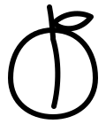

= mirabelle: Ein Taschencomputer zum Selberbauen
Olav Schettler
:doctype: book
:toc: left
:toclevels: 2
:sectnums:
:icons: font
:lang: de
:encoding: utf-8
:source-highlighter: rouge
:experimental:
:ebook-format: epub3
:author: Olav Schettler
:email: olav@schettler.net
:revnumber: 1.1
:revremark: Entwurf, entsteht mit dem Projekt
:description: Handbuch und Lehrbuch zu mirabelle: ein Taschencomputer im Stil von Macintosh System 1, gebaut in C und Lua, von der ersten Bitmap bis zum eigenen Gerät.
:keywords: C, Lua, SDL3, ESP32, Bitmapgrafik, Macintosh System 1, Gemtext
:copyright: Copyright (C) 2026 Olav Schettler. GNU GPL Version 3 oder neuer.

[preface]
== Vorwort

Dieses Buch beschreibt ein Programm, das du bauen kannst — Zeile für Zeile,
von der ersten gesetzten Bildpunktreihe bis zu einem Browser, den du selbst in
Lua schreibst.

**mirabelle** ist ein kleines Betriebssystem für persönliche Daten: Aufgaben,
Kalender, Adressbuch, Notizen, in der Optik des ersten Macintosh von 1984,
geschrieben in C, erweiterbar in Lua, und am Ende auf einem eigenen Gerät mit
Sieben-Zoll-Bildschirm.

Der Name gehört zur Sache. Eine Mirabelle ist klein, gelb und rund, sie wächst
ohne viel Zutun, und man isst sie in einem Bissen — nicht das größte Obst im
Garten, aber eines, das man ganz überblickt. Die Frucht steht als Zeichen ganz
links in der Menüleiste, dort, wo bei System 1 der Apfel saß.

Es ist absichtlich klein. Der Bildschirm hat ein Bit je Pixel, das
Dateiformat drei Regeln, die Schnittstelle zur Außenwelt neunzehn Funktionen.
Nichts davon ist Nostalgie: kleine Systeme kann man ganz verstehen, und wer
eines ganz versteht, versteht danach auch große besser.

=== Für wen ist das?

Für dich, wenn du schon einmal programmiert hast und wissen willst, wie die
Sachen *darunter* funktionieren. Wie kommt ein Buchstabe auf den Bildschirm?
Was passiert wirklich, wenn sich zwei Fenster überlappen? Warum ist ein
Dateiformat mit drei Regeln besser als eines mit dreißig?

Du brauchst keine Ausbildung und keinen Abschluss. Du brauchst Neugier, einen
Rechner und die Bereitschaft, Dinge kaputtzumachen und wieder zu reparieren.
Ab etwa dreizehn Jahren ist das gut zu schaffen. Wo ein Kapitel schwerer wird,
steht das vorher dabei.

C und Lua musst du nicht vorher können. C lernst du hier an echtem Code, und
für Lua gibt es ein eigenes Kapitel, das in einer knappen halben Stunde durch
die ganze Sprache führt.

=== Was du gebaut haben wirst

Ein Fenstersystem mit überlappenden Fenstern, Menüs und Dialogen. Eine eigene
Bitmapschrift, Buchstabe für Buchstabe von Hand gezeichnet, mit Umlauten, die
wirklich wie Umlaute aussehen. Einen Textsatz, der UTF-8 versteht. Zwei
Dateiparser. Eine Volltextsuche, die „Müller" findet, wenn du „Muller" tippst.
Und eine Anwendung, die aus einer Datendatei entsteht statt aus Programmcode.

Einen Browser für ein kleines Netzprotokoll, geschrieben in einer Skriptsprache,
die im selben Programm steckt.

Vor allem aber: eine Vorstellung davon, wie man so etwas *aufteilt*. Das ist
die Fähigkeit, die bleibt, wenn die Sprache längst eine andere ist.

=== Wie du dieses Buch liest

Die Kapitel bauen aufeinander auf, aber du musst nicht alles in der Reihenfolge
lesen.

[cols="1,3", options="header"]
|===
|Wenn du … |lies

|das Programm nur benutzen willst
|Kapitel 1 bis 3

|wissen willst, wie ein Fenstersystem funktioniert
|Kapitel 5 bis 7

|eine eigene Anwendung schreiben willst
|Kapitel 9, dann 10 und 12, dann 13

|verstehen willst, wie geprüft wird
|Kapitel 15 — es lohnt sich früher, als man denkt

|es auf ein Gerät bringen willst
|Kapitel 16, und vorher `DESIGN.md` Abschnitt 12
|===

[IMPORTANT]
.Was es schon gibt und was nicht
====
Das Projekt entsteht in siebzehn Schritten, die im Fahrplan `ROADMAP.md`
stehen. Gebaut sind **M1 bis M13** und **M17**: von der Bitmap bis zu den
Anwendungen, der Skriptanbindung und dem Spartan-Browser.

Offen sind drei: M14 (aufgezeichnete Bedienabläufe), M15 (Touch und
Bildschirmtastatur) und M16 (der Port auf das Gerät). Die Kapitel darüber
beschreiben, was *geplant* ist, und sagen das oben mit einem Hinweis
„Geplant". Ein Handbuch, das den Unterschied verwischt, ist ärgerlicher als
eines, das eine Lücke zugibt.

Alles andere in diesem Buch kannst du nachbauen, ausprobieren und ändern. Wo
eine Datei genannt wird, gibt es sie.
====

=== Die Lizenz

Programm und Buch stehen unter der **GNU General Public License, Version 3
oder neuer**. Der volle Text liegt als `LICENSE` im Repository, und
`./build/mirabelle --version` nennt sie dir auch ohne Nachschlagen.

Das heißt in aller Kürze: du darfst das Ganze benutzen, weitergeben und
verändern — und wenn du eine veränderte Fassung weitergibst, gibst du auch
deren Quelltext unter denselben Bedingungen weiter. Was du daheim für dich
änderst, geht niemanden etwas an.

Jede Quelldatei trägt dafür eine Zeile:

[source,c]
----
/* SPDX-License-Identifier: GPL-3.0-or-later */
----

Eine Zeile statt fünfzehn Zeilen Rechtstext je Datei. Sie ist maschinenlesbar,
und sie sagt dasselbe.

Die Bibliotheken, die das Programm benutzt, liegen nicht im Repository und
behalten ihre eigenen Bedingungen: Lua (MIT), SQLite (gemeinfrei) und SDL 3
(zlib). Alle drei vertragen sich mit der GPL.

include::01-einleitung.adoc[leveloffset=+1]

include::02-loslegen.adoc[leveloffset=+1]

include::03-bedienung.adoc[leveloffset=+1]

include::04-aufbau.adoc[leveloffset=+1]

include::05-pixel.adoc[leveloffset=+1]

include::06-schrift.adoc[leveloffset=+1]

include::07-fenster.adoc[leveloffset=+1]

include::08-daten.adoc[leveloffset=+1]

include::09-anwendungen.adoc[leveloffset=+1]

include::10-lua.adoc[leveloffset=+1]

include::11-api.adoc[leveloffset=+1]

include::12-luaapi.adoc[leveloffset=+1]

include::13-netz.adoc[leveloffset=+1]

include::14-erweitern.adoc[leveloffset=+1]

include::15-testen.adoc[leveloffset=+1]

include::16-geraet.adoc[leveloffset=+1]

include::17-glossar.adoc[leveloffset=+1]

[colophon]
== Impressum

*mirabelle: Ein Taschencomputer zum Selberbauen*

Autor: Olav Schettler +
Kontakt: olav@schettler.net

Macintosh und System 1 sind Marken von Apple Inc. Dieses Projekt ist eine
eigenständige Nachempfindung ihrer Gestaltung; es enthält keinen Code und
keine Schriften von Apple. Die Zeichensätze sind eigens für dieses Projekt
gezeichnet.

_Geschrieben mit AsciiDoc, gebaut mit Asciidoctor._
