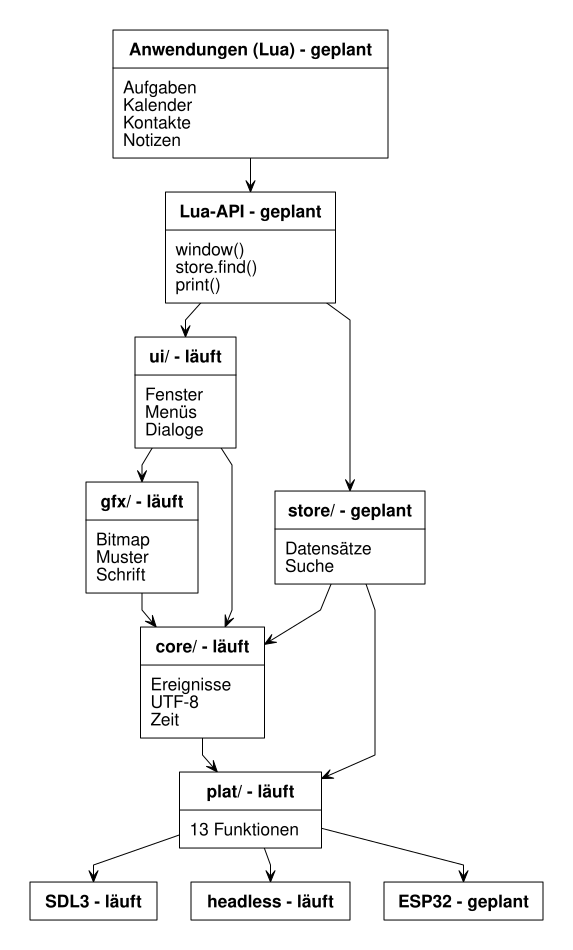

== Wie das Programm aufgebaut ist

Die letzten beiden Kapitel haben gezeigt, was das Programm tut. Dieses Kapitel
zeigt, wie es dafür gebaut ist — welche Teile es gibt und, wichtiger noch,
welche Teile *nichts voneinander wissen dürfen*.

=== Schichten, und wieso jede nur die direkt darunter kennt

`DESIGN.md` beschreibt das Programm als einen Stapel von Schichten, jede auf
der nächsten aufbauend:

[quote, DESIGN.md, Abschnitt 2]
____
Jede Schicht kennt nur die direkt darunter. `ui/` ruft nie SDL auf, `gfx/`
kennt keine Fenster, `store/` weiß nichts von Pixeln.
____

Das Diagramm am Ende dieses Kapitels zeigt den vollständigen Stapel: `core/`
(Ereignisse, UTF-8, Zeit, Sortierung), `gfx/` (Bitmap, Muster, Schrift), `ui/`
(Fenster, Menüs, Dialoge, Widgets), `store/` (Datensätze und Vault), `net/`
(das SPARTAN-Protokoll), `app/` (der generische Browser und die Schale),
`lua/` (die Skriptanbindung) und ganz unten `plat/`, die Plattformschicht, um
die es gleich geht. Alles davon läuft; nur `src/plat/plat_esp32.c` fehlt noch,
siehe den Hinweis weiter unten.

Ein Satz wie „`gfx/` kennt keine Fenster“ wäre in vielen Projekten eine
Absichtserklärung, die mit der Zeit verwässert — irgendwann importiert doch
irgendeine Datei aus der falschen Schicht, weil es gerade praktisch war. Hier
nicht, und der Grund dafür ist banal: Jede Schicht ist eine eigene
Programmbibliothek, und diese Bibliotheken verlinkt CMake nur in eine
Richtung. In `CMakeLists.txt` steht:

[source,cmake]
----
add_library(pda_gfx
    src/gfx/bitmap.c
    ...
)
target_link_libraries(pda_gfx PUBLIC pda_core)

add_library(pda_ui
    src/ui/theme.c
    src/ui/window.c
    src/ui/wm.c
    src/ui/menu.c
    src/ui/dialog.c
)
target_link_libraries(pda_ui PUBLIC pda_gfx pda_core pda_fonts)
----

`pda_ui` verlinkt gegen `pda_gfx` und `pda_core` — sonst gegen nichts. SDL3
selbst ist ausschließlich mit der Plattformschicht verlinkt:

[source,cmake]
----
add_library(pda_plat_sdl3
    src/plat/expand.c
    src/plat/plat_sdl3.c
    src/plat/plat_files_posix.c
)
target_link_libraries(pda_plat_sdl3 PUBLIC pda_gfx PRIVATE PkgConfig::SDL3)
----

Würde jemand versehentlich `#include <SDL3/SDL.h>` in einer Datei unter
`src/ui/` einbauen, gäbe es dafür in `pda_ui` gar keinen Include-Pfad zu SDL3 —
die Datei würde nicht einmal übersetzen, geschweige denn verlinken. Die Regel
steht also nicht nur als Kommentar da, sie ist Teil des Bauplans. Das ist mehr
wert als jede Konvention, die sich nur auf gute Vorsätze verlässt.

=== Die neunzehn Plattformfunktionen

Ganz unten im Stapel liegt `plat/` — die gesamte Schnittstelle zur Außenwelt.
Der Kommentar am Anfang von `src/plat/plat.h` sagt es geradeheraus:

[quote, src/plat/plat.h]
____
Neunzehn Funktionen. Wer auf ein neues Gerät portiert, implementiert genau das
und sonst nichts.
____

Sie gliedern sich in sechs Gruppen:

[cols="1,3", options="header"]
|===
|Gruppe |Funktionen

|Leben
|`plat_init`, `plat_shutdown`

|Anzeige
|`plat_display_size`, `plat_present`

|Eingabe
|`plat_poll`

|Zeit
|`plat_ticks_ms`, `plat_sleep_ms`

|Dateien
|`plat_open`, `plat_read`, `plat_write`, `plat_close`, `plat_list`,
 `plat_mkdir`, `plat_rename`, `plat_remove`

|Netz
|`plat_connect`, `plat_send`, `plat_recv`, `plat_disconnect`
|===

Neunzehn Funktionen. Das ist wenig genug, dass eine Portierung auf ein neues
Gerät überschaubar bleibt: Wer den nächsten Mikrocontroller anschließen will,
muss nicht wissen, wie ein Fenster oder ein Menü funktioniert, sondern nur, wie
man dort ein Bild zeigt, ein Ereignis abholt, eine Datei liest und eine
Verbindung aufbaut.

Die Zahl selbst verdient eine Anmerkung. Beim Entwurf standen hier zwölf.
`plat_mkdir` kam dazu, weil der Vault Verzeichnisse anlegen muss;
`plat_rename` und `plat_remove` für sicheres Speichern — erst vollständig in
eine Nebendatei schreiben, dann darüberlegen; die vier Netzfunktionen mit dem
Spartan-Browser. `DESIGN.md` kommentiert das selbst:

[quote, DESIGN.md, Abschnitt 3]
____
Die Zahl ist keine Zusage, wohl aber die Größenordnung: diese Schicht bleibt
klein genug, dass eine Portierung überschaubar ist.
____

Eine runde Zahl klingt nach einem endgültigen Entwurf. Sie war das nie — sie
ist ein Nebenprodukt davon, alles, was wirklich gebraucht wird, in dieser
Schicht zu halten, nicht mehr und nicht weniger. Wird morgen eine zwanzigste
Funktion nötig, kommt sie dazu; keine wird erfunden, nur damit die Zahl
stimmt.

Damit die Zahl nicht still veraltet, zählt `tests/plat_count.sh` bei jedem
Testlauf die Deklarationen in `plat.h` und vergleicht sie mit dem, was hier,
in `DESIGN.md` und im Kopf der Datei selbst steht. Eine Zahl, die niemand
nachzählt, ist irgendwann keine Angabe mehr, sondern eine Erinnerung.

Bemerkenswert ist, wie wenig die Netzfunktionen wissen. Keine kennt ein
Protokoll — sie schicken Bytes und holen Bytes. Umgekehrt kennt der
SPARTAN-Code (`src/net/spartan.c`) keine davon: er bekommt seinen Transport
übergeben. Deshalb lässt sich das Protokoll ohne Netz prüfen, und der Umbau
auf die Netzbibliothek des Geräts berührt es nicht.

Bemerkenswert ist auch, was *nicht* dazukam, als Touch-Eingabe geplant wurde.
Ein Fingertipp ist in diesem Entwurf ein Mausereignis mit `button = 1`; nur ein
zusätzliches Feld `is_touch` am Ereignis selbst sagt der Oberfläche, dass es
diesmal keinen Zustand „Maus schwebt über etwas, ohne gedrückt zu sein“ gibt.
Die Plattformschicht wächst dadurch mit einem einzigen Feld, nicht mit
weiteren Funktionen.

=== Drei Umsetzungen: SDL3, ESP32, headless

Zu dieser einen Schnittstelle gibt es drei Umsetzungen: eine für den
Arbeitsplatz, eine, die überhaupt keine echte Ausgabe hat, und — geplant — eine
für das Zielgerät.

**SDL3** (`src/plat/plat_sdl3.c`) ist die, die du in Kapitel 2 gestartet hast.
Sie überlässt SDL bewusst zwei Dinge, die man leicht selbst falsch rechnet:
die ganzzahlige Vergrößerung des Fensters und die Umrechnung von
Mauskoordinaten zurück in die logische Auflösung. Der Kommentar am Dateianfang
nennt den Grund:

[quote, src/plat/plat_sdl3.c]
____
Damit entfällt die gesamte Fehlerklasse "stimmt bei einfacher Vergrößerung,
verschiebt sich bei doppelter".
____

**ESP32** ist die Umsetzung für das eigentliche Zielgerät, einen Sunton
ESP32-8048S070C mit angeschlossenem 7-Zoll-Bildschirm.

[NOTE]
.Noch nicht gebaut
====
`src/plat/plat_esp32.c` existiert im Repository noch nicht — diese Umsetzung
gehört zu Meilenstein M16. Was in `DESIGN.md`, Abschnitt 12, dazu steht, ist
detailliert, weil es aus einem bereits verifizierten Port auf genau dieser
Platine übernommen wurde (Projekt Draftling, unter `extern/draftling`) — aber
es ist Planung, kein lauffähiger Code.
====

**headless** (`src/plat/plat_headless.c`) ist die dritte und, wie die
Roadmap es nennt, „keine Notlösung, sondern der Grund, warum sich fast alles
ohne Bildschirm prüfen lässt“. Sie ist der eigentliche Kniff dieses ganzen
Entwurfs, und es lohnt sich, genau hinzusehen, warum.

`plat_present()` bekommt bei jeder Umsetzung dieselbe Bitmap aus dem Kern
übergeben. Bei SDL3 landet sie auf einem echten Fenster. Bei headless landet
sie einfach in einer weiteren Bitmap im Speicher:

[source,c]
----
static bitmap s_frame;

void plat_present(const bitmap *fb)
{
    s_present_count++;
    if (fb->w == s_frame.w && fb->h == s_frame.h)
        memcpy(s_frame.bits, fb->bits, bitmap_bytes(fb));
}
----

Ein Test kann sich diese Bitmap danach einfach ansehen — mit
`plat_headless_frame()` — und mit einem Sollbild vergleichen, genau wie in
Kapitel 1 und 2. Kein Fenstersystem, kein Bildschirm, keine Grafikkarte nötig.

Ereignisse laufen genauso andersherum. Wo SDL3 Mausklicks und Tastendrücke
vom Betriebssystem abholt, füllt bei headless ein Test selbst eine
Warteschlange, und `plat_poll()` liest einfach von vorn heraus:

[source,c]
----
void plat_headless_push_event(const event *e)
{
    if (s_count >= QUEUE_MAX) return;
    s_queue[(s_head + s_count) % QUEUE_MAX] = *e;
    s_count++;
}
----

Ein Test kann also einen Mausklick auf eine bestimmte Stelle „senden“, ohne
dass irgendwo eine Maus oder ein Bildschirm existiert. Sogar die Uhr steht in
dieser Umsetzung still, bis ein Test sie ausdrücklich vorstellt:

[source,c]
----
void plat_sleep_ms(uint32_t ms)
{
    s_now += ms;
}
----

Das Programm schläft in Tests also nie wirklich — die Uhr springt einfach um
den angeforderten Betrag weiter. Ein Testlauf braucht dadurch Millisekunden
statt der Sekunden, die echtes Warten kosten würde, und liefert dabei bei
jedem Aufruf exakt dasselbe Ergebnis.

Damit schließt sich der Kreis zu Regel 4 aus Kapitel 1, „testbar ohne
Bildschirm“: Sie ist keine Behauptung, sondern eine direkte Folge davon, dass
der Kern ausschließlich über `plat_present()` in eine Bitmap zeichnet und
ausschließlich über `plat_poll()` von Ereignissen erfährt. Eine dritte,
bildschirmlose Umsetzung dieser beiden Funktionen reicht, um fast das gesamte
Programm ohne Fenster zu prüfen — genau das, was `make test` in Kapitel 2 die
ganze Zeit tut.

Eine kleine Randbemerkung noch zu den Dateifunktionen: `plat_files_posix.c`
wird von SDL3 *und* von headless gemeinsam benutzt, nicht doppelt
geschrieben. Der Kommentar in `CMakeLists.txt` sagt, warum das geht und warum
es beim Gerät nicht mehr geht:

[quote, CMakeLists.txt]
____
Die Dateifunktionen sind für alles gleich, was ein POSIX-artiges Dateisystem
hat, und liegen deshalb getrennt. Der ESP32 bekommt später eine eigene
Umsetzung und bindet plat_files_posix.c einfach nicht ein.
____

=== Zum Ausprobieren

. Öffne `src/plat/plat.h` und zähle die deklarierten Funktionen nach. Kommst
  du auf dreizehn? Ordne jede der fünf Gruppen aus diesem Kapitel zu.

. Überlege (ohne es tatsächlich einzubauen): Was würde passieren, wenn du in
  `src/ui/window.c` ein `#include <SDL3/SDL.h>` einfügst? Sieh dir dafür an,
  welche Include-Pfade `target_link_libraries(pda_ui ...)` in
  `CMakeLists.txt` tatsächlich freigibt.

. Lies `src/plat/plat_headless.c` vollständig. Wie viele Zeilen hat die Datei
  insgesamt, und wie viele davon hängen mit dem Dateisystem zusammen (Hinweis:
  die liegen in einer anderen Datei)?

. Zähle in `CMakeLists.txt` die Aufrufe von `add_library`. Wie viele getrennte
  Bibliotheken bilden das Programm insgesamt, und welche davon sind reine
  Testwerkzeuge statt eigentliche Schichten?
