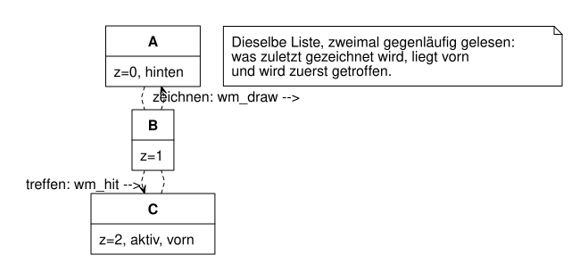
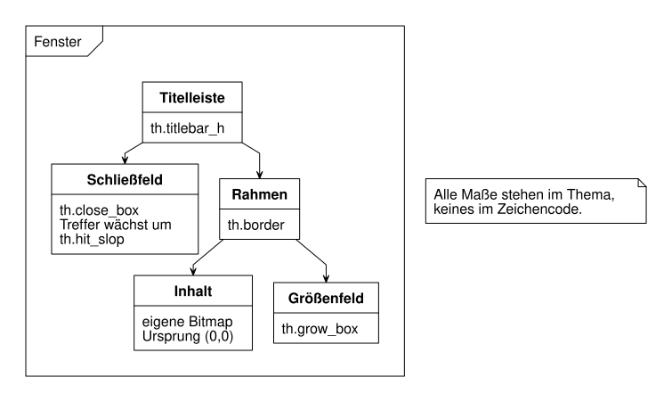

== Überlappende Fenster

Ein Fenstersystem, das mehrere Fenster gleichzeitig zeigt, muss zwei Fragen
beantworten, die auf den ersten Blick nichts miteinander zu tun haben: Welches
Fenster sieht der Nutzer an einer bestimmten Stelle? Und welches Fenster trifft
ein Klick an derselben Stelle? Dieses Kapitel zeigt, wie `src/ui/wm.c` beide
Fragen mit derselben Liste beantwortet — und wie zwei Fehler beim Bau
tatsächlich auftraten.

=== Die z-sortierte Liste

Die Fensterverwaltung hält ihre Fenster in einer einzigen Liste, sortiert nach
Tiefe. Der Kopf von `src/ui/wm.h` fasst den ganzen Mechanismus in einem Satz:

[source,c]
----
/* Eine z-sortierte Liste, mehr ist es nicht: von hinten nach vorn zeichnen,
 * von vorn nach hinten treffen. Überlappung entsteht daraus ohne Zusatzaufwand. */
----

`wm_internal.h` legt fest, was „hinten“ und „vorn“ bedeuten: Index 0 ist das
hinterste Fenster.

[source,c]
----
window     **z;         /* z-sortierte Liste, [0] hinten, Eigentümer der Fenster */
----

Gezeichnet wird von hinten nach vorn, damit ein vorderes Fenster ein
hinteres verdeckt — nicht umgekehrt. `wm_draw` in `src/ui/wm.c` zeigt genau
das:

[source,c]
----
for (int i = 0; i < m->count; i++)
    window_draw(m->z[i], g);
----

Getroffen wird in der *umgekehrten* Richtung. `wm_hit` läuft die Liste von
vorn nach hinten durch und liefert das erste Fenster, das die Koordinate
enthält:

[source,c]
----
for (int i = m->count - 1; i >= 0; i--) {
    window *w = m->z[i];
    ...
    rect frame = window_frame(w);
    if (!rect_contains(frame, x, y)) continue;
    ...
}
----

Läge dieselbe Stelle unter zwei Fenstern, gewinnt beim Zeichnen das vordere,
weil es zuletzt gemalt wird — und beim Klicken gewinnt ebenfalls das vordere,
weil die Suche bei ihm beginnt. Beide Reihenfolgen sind einander entgegen-
gesetzt, aber sie stimmen überein: was man sieht, ist auch, was man trifft.
Das ist Überlappung *ohne* Zusatzaufwand — keine Fensterhierarchie, kein
eigener Mechanismus für „was liegt worüber“, nur eine Liste, zweimal in
entgegengesetzter Richtung gelesen.

`tests/unit/test_wm.c` hält beide Richtungen unabhängig fest,
`overlap_is_hit_front_to_back` und `overlap_is_drawn_back_to_front` — mit
zwei Fenstern, die sich tatsächlich überlappen. Der Kommentar in der
Testdatei erklärt, warum das wichtig war: eine frühere Fassung des Tests
prüfte zwei Fenster, die einander gar nicht überdeckten, und hätte eine
vertauschte Reihenfolge in keiner der beiden Richtungen bemerkt.

=== D-5: jedes Bild vollständig neu

Wenn sich ein Fenster bewegt oder ein Menü aufklappt, zeichnet die
Fensterverwaltung nicht nur den veränderten Ausschnitt neu — sie zeichnet das
*ganze* Bild neu, jedes Mal. `wm_draw` beginnt bei jedem Aufruf mit
`gfx_clear` über den gesamten Schirm und baut von dort alles wieder auf.

Das klingt nach Verschwendung, ist aber eine bewusste Entscheidung, D-5, und
die Rechnung dahinter ist dieselbe wie in Kapitel 5: ein volles Bild bei
800 × 480 Pixeln braucht 48 000 Bytes. Bei dreißig Bildern in der Sekunde
sind das `48 000 × 30 = 1 440 000` Bytes, also rund 1,4 MB pro Sekunde. Für
beide Zielsysteme — den Arbeitsplatz und den ESP32 — ist das nichts.

Der Lohn dieser Entscheidung ist, was dadurch *entfällt*: kein
Damage-Tracking, das sich merkt, welcher Bildausschnitt seit dem letzten Bild
schmutzig geworden ist; keine Regionenarithmetik, die mehrere überlappende
schmutzige Rechtecke zu einer minimalen Fläche zusammenfasst; keine
Expose-Ereignisse, mit denen ein Fenster erführe, dass ein Teil von ihm
plötzlich wieder sichtbar wurde, weil ein anderes Fenster weggezogen wurde.
`src/ui/wm.h` nennt das die „komplizierteste Fehlerklasse in GUI-Systemen“ —
und sie entfällt ersatzlos, weil es nie einen Zustand gibt, in dem der
Bildschirm nur *teilweise* aktuell ist.

Dass die tatsächliche *Ausgabe* auf dem Gerät trotzdem sparsam mit der
Übertragung an den Bildschirm umgehen muss, ist ein eigenes Problem der
Plattformschicht — der Kern aus `ui/` erfährt davon nichts und muss nichts
davon wissen.

=== Der XOR-Umriss beim Ziehen

Zieht man ein Fenster an seiner Titelleiste, bewegt sich das Fenster nicht
sofort mit. Stattdessen erscheint ein Umriss, der der Maus folgt, und erst
beim Loslassen springt das Fenster dorthin. `wm_event` in `src/ui/wm.c`
unterscheidet klar zwischen dem *Umriss*, der bei jeder Mausbewegung
fortgeschrieben wird, und dem *Rahmen* des Fensters, der unverändert bleibt:

[source,c]
----
case EV_MOUSE_MOVE: {
    if (m->drag == DRAG_NONE) return false;

    int  dx = e->x - m->anchor_x;
    int  dy = e->y - m->anchor_y;
    rect r  = m->start_frame;

    if (m->drag == DRAG_MOVE) {
        r.x += dx;
        r.y += dy;
        clamp_move(m, &r);
    } else {
        ...
    }

    m->outline = r;   /* nur der Umriss wandert */
    return true;
}
----

Erst bei `EV_MOUSE_UP` übernimmt das Fenster tatsächlich die neue Lage:

[source,c]
----
case EV_MOUSE_UP:
    if (m->drag == DRAG_NONE) return false;

    window_set_frame(m->drag_win, m->outline);
    m->drag     = DRAG_NONE;
    m->drag_win = NULL;
    return true;
----

Gezeichnet wird der Umriss mit genau dem Mechanismus aus Kapitel 5: mit
`GFX_XOR`. `wm_draw` zeichnet ihn als letztes, nach allen Fenstern:

[source,c]
----
if (m->drag != DRAG_NONE) {
    g->pat  = PAT_BLACK;
    g->mode = GFX_XOR;
    gfx_frame_rect(g, m->outline);
    g->mode = GFX_COPY;
}
----

Weil der Schirm ohnehin bei jedem Bild komplett neu aufgebaut wird — siehe
D-5 — muss der Umriss nicht eigens gelöscht werden. Er wird bei jedem Bild
neu über das frisch gezeichnete Fenster gelegt, an der aktuellen Stelle von
`m->outline`. XOR sorgt dafür, dass er als Linie sichtbar ist, ohne dass
irgendetwas Zusätzliches unter ihm gesichert werden müsste. Das ist
historisch die Art, wie frühe grafische Oberflächen Fenster verschoben haben,
und zugleich der billigste mögliche Weg, es zu tun.

=== Das Thema als Datei

Titelleistenhöhe, Randstärke, die Größe des Schließfelds — all das steht
nicht als Zahl im Zeichencode, sondern in `data/themes/desktop.theme`:

[source]
----
titlebar_h    20
border         1
close_box     11
grow_box      15
box_margin     5
stripe_gap     2
title_pad      6
hit_slop       0
min_w         96
min_h         48
font          system12
----

`src/ui/theme.h` erklärt, warum das eine eigene Datei ist statt verstreuter
Zahlen im Code: auf dem Gerät bekommt die Oberfläche irgendwann ein zweites
Thema mit größeren Bedienelementen, weil dort ein Finger auf den Bildschirm
trifft statt eines Mauszeigers. Stünden die Maße im Zeichencode, würde daraus
bei jeder Fallunterscheidung eine eigene `if`-Verzweigung.

Genau dafür gibt es `hit_slop`: die Trefferfläche eines Feldes wächst um
diesen Wert über die *gezeichnete* Fläche hinaus, ohne dass sich am
Gezeichneten selbst etwas ändert. `wm_hit` wendet das über `grow_and_clamp`
an:

[source,c]
----
static rect grow_and_clamp(rect r, int slop, rect clamp)
{
    r.x -= slop;
    r.y -= slop;
    r.w += 2 * slop;
    r.h += 2 * slop;
    return rect_intersect(r, clamp);
}
----

Der Grund dafür ist eine Zahl, die sich leicht überschlagen lässt: bei 133
Pixeln je Zoll ist ein bequem treffbarer Finger etwa 9 mm breit, umgerechnet
rund 47 Pixel. Ein gezeichnetes Schließfeld von elf Pixeln Kantenlänge — wie
`close_box` es im Thema oben festlegt — wäre mit einem Finger praktisch
unbedienbar. `hit_slop` löst das, ohne die gezeichnete Fläche zu vergrößern:
das Feld sieht klein und aufgeräumt aus, ist aber großzügig genug zu treffen.
Auf dem Arbeitsplatz mit Mauszeiger steht `hit_slop` deshalb auf 0 — dort
braucht es das nicht.

`tests/unit/test_wm.c` prüft genau diesen Unterschied, indem es zwei
Verwaltungen mit unterschiedlichem `hit_slop` gegen denselben Klickpunkt
antreten lässt:

[source,c]
----
window  *hit1 = wm_hit(m1, x, y, &part);
CHECK(hit1 == w1);
CHECK(part != HIT_CLOSE_BOX);   /* ohne hit_slop kein Treffer auf das Feld */

window *hit2 = wm_hit(m2, x, y, &part);
CHECK(hit2 == w2);
CHECK_EQ(part, HIT_CLOSE_BOX);   /* mit hit_slop=6 schon */
----

=== Zwei Fehler beim Bau

Beide folgenden Fehler stammen aus der tatsächlichen Entwicklungsgeschichte
des Projekts. Beide zeigen etwas, das keine noch so sorgfältige Codeprüfung
von allein findet.

==== Ein Zeiger auf ein Thema, das nicht mehr existierte

Als die Fensterverwaltung entstand, speicherte `wm_create` zunächst nur einen
*Zeiger* auf das übergebene Thema, nicht das Thema selbst. Eine Testhilfe
legte ihr Thema als lokale Variable an und übergab dessen Adresse an
`wm_create` — und nach der Rückkehr dieser Hilfsfunktion existierte diese
Variable nicht mehr. Ihr Speicher, ein paar Bytes auf dem Stapelspeicher
(dem "stack"), konnte längst von etwas anderem überschrieben sein.

Der Test hing danach, ohne eine einzige Zeile Ausgabe zu erzeugen. Der Grund:
`window_draw` las über den toten Zeiger Maße, die nicht mehr die ursprünglich
gesetzten Werte waren, sondern Zufallswerte aus wiederverwendetem
Stapelspeicher — und füllte damit ein absurd großes Rechteck. Eine Schleife,
die über ein Rechteck mit einer solchen Kantenlänge zeichnet, stürzt dabei
nicht ab und gibt auch keine Fehlermeldung aus — sie läuft einfach immer
weiter. Gefunden wurde die Ursache erst mit einer Stichprobe des laufenden,
scheinbar hängenden Prozesses: ein Blick auf seinen aktuellen Aufrufstapel
zeigte ihn mitten in der Zeichenschleife über dieses eine, riesige Rechteck
fest.

Die Reparatur ist eine einzige Zeile in `wm_create`, in `src/ui/wm.c`:

[source,c]
----
m->th       = *th;   /* Kopie, damit der Aufrufer sein Thema nicht am Leben halten muss */
----

Statt eines Zeigers hält die Verwaltung jetzt eine *Kopie* des Themas. Ein
Thema ist, wie `theme.h` zeigt, eine Handvoll Ganzzahlen — das Kopieren
kostet nichts der Rede Wert, und damit entfällt eine ganze Klasse von
Zeigerfallen: niemand außerhalb der Verwaltung muss ihr Thema künstlich am
Leben erhalten, nur damit die Verwaltung später noch darauf zugreifen darf.

==== Der Absturz beim Klick auf das Schließfeld

Der zweite Fehler war handfester: ein Klick auf das Schließfeld ließ das
ganze Programm abstürzen. Die Ursache lag darin, dass die Fensterverwaltung
ein Fenster *selbst* schließt, sobald der Nutzer das Schließfeld trifft —
`wm_event` ruft dafür intern `wm_close` auf. Der Eigentümer des Fensters, die
Anwendung, erfuhr davon aber nichts. Sie hielt weiterhin einen Zeiger auf
dieses Fenster und zeichnete beim nächsten Bild in bereits freigegebenen
Speicher hinein.

Die Lösung ist eine Rückmeldung, `window_set_on_close`, deklariert in
`src/ui/window.h`:

[source,c]
----
/* Wird gerufen, kurz bevor das Fenster freigegeben wird - gleich ob über das
 * Schließfeld, über wm_close oder beim Abräumen der ganzen Verwaltung.
 *
 * Der Eigentümer erfährt sonst nichts davon: die Fensterverwaltung schließt
 * ein Fenster selbst, wenn der Nutzer das Schließfeld trifft, und ein
 * Anwendungszeiger auf dieses Fenster zeigte danach ins Leere. Genau daran ist
 * die Vorführung einmal abgestürzt.
 *
 * Die Rückmeldung darf das Fenster nicht erneut schließen. */
typedef void (*window_close_fn)(window *w, void *user);
void window_set_on_close(window *w, window_close_fn fn, void *user);
----

Entscheidend ist der Satz „gleich ob über das Schließfeld, über `wm_close`
oder beim Abräumen der ganzen Verwaltung“. Es gibt drei Wege, wie ein Fenster
verschwinden kann, und ein Eigentümer, der nur einen davon kennt, vergisst
irgendwann einen der anderen. Die Lösung dafür ist kein Aufruf an drei
Stellen, sondern ein einziger, an der Stelle, durch die *alle* drei Wege
zwangsläufig laufen — `window_destroy` in `src/ui/window.c`:

[source,c]
----
void window_destroy(window *w)
{
    if (!w) return;

    /* Erst der Eigentümer, dann freigeben. Andersherum bekäme er einen Zeiger
     * auf bereits freigegebenen Speicher. */
    if (w->on_close) w->on_close(w, w->on_close_user);

    bitmap_free(&w->content);
    free(w);
}
----

`wm_close` ruft `window_destroy` auf, und `wm_destroy` ruft es beim Abräumen
für jedes verbliebene Fenster auf — der Klick auf das Schließfeld führt über
`wm_close` zum selben Punkt. Damit die Rückmeldung *vor* der Freigabe kommt,
steht der Aufruf als Erstes in der Funktion, noch vor `bitmap_free`. Ein
Eigentümer, der `window_set_on_close` einmal einrichtet, kann sich seither
darauf verlassen, benachrichtigt zu werden, egal auf welchem der drei Wege
sein Fenster verschwindet — genau wie das Clipping aus Kapitel 5 an einer
einzigen Stelle geprüft wird, wird das Schließen an einer einzigen Stelle
gemeldet.

=== Zum Ausprobieren

. Öffne mit `wm_open` drei Fenster, die sich alle an derselben Stelle
  überlappen. Rufe `wm_hit` für einen Punkt in dieser Überlappung auf, dann
  `wm_activate` für das hinterste Fenster, und rufe `wm_hit` erneut auf.
  Welches Fenster wird jetzt getroffen, und warum?

. Lies `data/themes/desktop.theme` und rechne nach, wie breit das
  Schließfeld inklusive `hit_slop` mindestens sein müsste, damit es für einen
  47 Pixel breiten Finger bequem zu treffen ist. Vergleiche mit dem Wert von
  `close_box` in der Datei.

. Schreibe eine kleine Anwendung nach dem Vorbild von `src/demo.c`, öffne ein
  Fenster und richte `window_set_on_close` ein. Schließe das Fenster einmal
  über `wm_close` und einmal, indem du in `wm_event` einen Klick auf das
  Schließfeld simulierst — die Rückmeldung muss in beiden Fällen kommen.

. Zeichne von Hand nach, wie `m->outline` sich während eines simulierten
  `EV_MOUSE_DOWN`, mehrerer `EV_MOUSE_MOVE` und eines `EV_MOUSE_UP`
  verändert, während `window_frame` unverändert bleibt — bis zum letzten
  Schritt.
