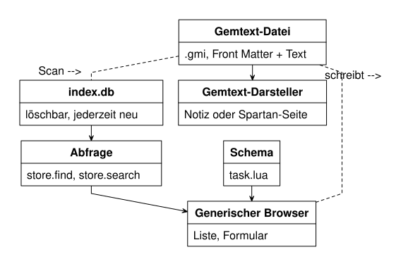

== Wo die Daten liegen

Ein PIM-Paket — Aufgaben, Kalender, Adressbuch, Notizen — ist im Kern eine
Frage, die nichts mit Bildschirmen zu tun hat: Wo genau liegt „Milch kaufen",
und was passiert damit, wenn das Programm nicht läuft, der Rechner kaputtgeht
oder du in zehn Jahren doch noch einmal nachsehen willst, was am
22. August 2026 anstand? Dieses Kapitel beantwortet das, bevor das
nächste zeigt, wie daraus Anwendungen werden.

=== Die Dateien sind die Wahrheit

Entscheidung D-3 aus `DESIGN.md` ist kurz und hat es trotzdem in sich: SQLite
ist ausschließlich Index, niemals Quelle. Jeder Datensatz — jede Aufgabe,
jeder Termin, jeder Kontakt, jede Notiz — liegt als eigene Datei im
Dateisystem. Die Datenbank daneben, `index.db`, enthält nichts, was nicht
auch in diesen Dateien steht. Sie zu löschen darf kein einziges Byte
Nutzdaten kosten.

[source]
----
~/PDA/
  vault.conf
  Aufgaben/20260822T151400-a3f9.gmi
  Termine/20260822T093000-7c21.gmi
  Kontakte/20260819T112233-0f5e.gmi
  Notizen/20260820T201500-b8d4.gmi
  index.db          -- ableitbar, jederzeit löschbar
----

Warum diesen Umweg gehen, wo eine einzige Datenbankdatei doch viel bequemer
wäre? Drei Gründe, und keiner davon ist Bequemlichkeit für später:

**Die Daten überleben das Programm.** Stirbt das PDA-Projekt in zwanzig
Jahren — weil der Mikrocontroller nicht mehr hergestellt wird, weil du die
Lust verlierst, weil eine neue Idee kommt —, bleiben deine Notizen lesbare
Textdateien. Kein Programm muss sie retten. Das ist der Unterschied zwischen
einem Format, das *dir* gehört, und einem, das nur der Anwendung gehört, die
es geschrieben hat.

**Man kann sie mit jedem Editor ansehen.** Ein `index.db` ist eine Blackbox,
die ein Datenbankwerkzeug braucht, um sie zu öffnen. Eine `.gmi`-Datei öffnest
du mit `cat`, mit einem beliebigen Texteditor, mit `grep`, wenn du nach einem
Wort in allen deinen Notizen suchst. Kein Sonderwerkzeug, kein Treiber, keine
Versionsfrage, ob dieses Datenbankformat in zehn Jahren noch gelesen werden
kann.

**Ein Test erzwingt die Zusage.** Eine Absicht, die nirgends geprüft wird,
verkommt mit der Zeit zu einer Ausrede. Deshalb steht die Zusage aus D-3 als
Test: Verzeichnis einlesen, Index bauen, Index löschen, aus den Dateien neu
bauen, beide Abzüge vergleichen. Sind sie identisch, hat der Index tatsächlich
nichts hinzuerfunden. Genau dasselbe Prinzip wie die Füllbit-Zusage aus
Kapitel 5 — eine Behauptung ist nur so viel wert wie der Test, der sie prüft.

`index.db` ist trotzdem kein Luxus. Ohne ihn müsste jede Suche und jede
Sortierung sämtliche Dateien öffnen und lesen — bei ein paar tausend
Datensätzen spürbar langsam. Der Index macht das schnell, aber er ist eine
*Abkürzung*, kein Aufbewahrungsort. Abschnitt 9.4 dieses Kapitels zeigt, wie
er entsteht.

Die IDs in den Dateinamen — `20260822T151400-a3f9` — sind bewusst kein
UUID und keine fortlaufende Zahl. Ein Zeitstempel bis zur Sekunde, ein
kurzer zufälliger Rest gegen Kollisionen. Das Ergebnis sortiert sich von
selbst nach Anlagezeit, wenn du die Dateien im Verzeichnis auflistest, ist
für einen Menschen lesbar, und du brauchst keine externe Bibliothek dafür.

=== Gemtext: ein Textformat mit sechs Zeilentypen

Der Inhalt jeder Datei — was hinter dem Front Matter kommt — ist Gemtext,
nicht Markdown. Bevor du fragst, warum: sieh dir erst an, wie wenig das
Format überhaupt ist. Drei Kernzeilentypen:

* **Text.** Eine Zeile, die mit keinem Sonderzeichen beginnt, ist einfach
  Text. Kein Kursiv, kein Fett, keine Auszeichnung mittendrin — was du
  tippst, ist, was angezeigt wird.
* **Verweis**, eingeleitet mit `=>`. Eine Zeile, ein Ziel, optional ein
  Beschriftungstext danach.
* **Umschalter für vorformatierten Text**, drei Rückwärts-Anführungszeichen
  auf einer eigenen Zeile. Er schaltet zwischen normalem Text und einem
  Block um, in dem nichts mehr interpretiert wird — nützlich für Codeschnipsel
  oder ASCII-Tabellen, die genau so bleiben sollen, wie sie eingegeben wurden.

Dazu drei optionale, die alle nur am Zeilenanfang etwas bedeuten:

* **Überschriften** mit `#`, `##`, `###` — je mehr Rauten, desto tiefer die
  Ebene.
* **Listenpunkte** mit `* `.
* **Zitate** mit `>`.

Das ist alles. Keine verschachtelten Listen, keine Tabellen, keine Links
mitten im Satz, kein `**fett**` oder `_kursiv_`. Genau das macht den Parser
so klein: er braucht **ein einziges Bit Zustand** — steckt er gerade in
einem vorformatierten Block oder nicht? — und liest die Datei in einem
einzigen Durchlauf von oben nach unten. Jede Zeile entscheidet für sich, was
sie ist; keine Zeile hängt vom Inhalt einer anderen ab.

So sieht eine vollständige Datensatzdatei aus, mit Front Matter und
Gemtext-Körper, wie `DESIGN.md` sie zeigt:

[source]
----
---
type: task
title: Milch kaufen
due: 2026-08-25
priority: 2
done: false
tags: [Besorgung, Küche]
---
Beim Bäcker nebenan gibt es auch Brötchen für Fräulein Müller.

## Zutaten

* Milch, 1,5 %
* Brötchen

=> gemini://example.org/rezepte/  Wo das Rezept herkam
----

Die Dateiendung ist `.gmi`, wie in der Gemini-Welt üblich, aus der das
Format stammt. Der Medientyp ist `text/gemini`.

=== Ehrlich verglichen mit Markdown

Markdown kannst du wahrscheinlich schon. Warum also nicht einfach das nehmen,
statt ein weiteres Format zu lernen?

Markdown ist mächtiger — und genau das ist sein Problem für dieses Projekt.
Fettschrift, Kursivschrift, verschachtelte Listen, Tabellen, Links mitten im
Satz, manchmal sogar eingebettetes HTML: jedes davon ist eine Entscheidung,
die ein Darsteller treffen muss, und jede Markdown-Variante trifft sie ein
bisschen anders. Ein vollständiger Markdown-Parser ist ein Vielfaches der
Größe eines Gemtext-Parsers, und wo man ihn absichtlich unvollständig lässt
— „wir unterstützen kein verschachteltes Fett in Listen" —, ist das
Geschmackssache, die irgendwann jemand diskutieren will.

Gemtext verzichtet auf all das von vornherein. Das ist ein echter Verlust:
Du kannst in einer Notiz kein Wort betonen, keine Tabelle einfügen. Für ein
persönliches Datensatzformat ist das ein Kompromiss, den man ehrlich als
solchen benennen sollte, nicht schönreden.

Der entscheidende Grund, ihn trotzdem einzugehen, ist keiner der drei
technischen — er steht in `DESIGN.md` unter Entscheidung D-12: **der
Notizen-Darsteller und der Spartan-Browser aus Schritt M17 werden dieselbe
Funktion.** Spartan ist das einfache Netzwerkprotokoll, mit dem das
PDA-Projekt später Seiten aus dem Netz abrufen und darstellen kann, und
Gemtext ist genau das Format, das Spartan- und Gemini-Server ausliefern.
Zeigt das Projekt eine abgerufene Seite an, ist das Gemtext. Zeigt es eine
eigene Notiz an, ist das — wenn der Textkörper ebenfalls Gemtext ist — exakt
derselbe Vorgang. Eine Notiz über das Netz auszuliefern heißt dann: das Front
Matter überspringen, den Rest unverändert senden. Keine Umwandlung, kein
Zwischenformat, kein zweiter Darsteller mit einer zweiten, leicht
abweichenden Vorstellung davon, was eine Überschrift ist.

Mit Markdown gäbe es diese Übereinstimmung nicht geschenkt. Du bräuchtest
entweder zwei Darsteller — einen für Notizen, einen für abgerufene
Gemtext-Seiten — oder einen Umwandlungsschritt dazwischen, der selbst wieder
Fehlerquelle wäre. Ein Format, zwei Verwendungen, ein Darsteller: das ist der
Tausch, den Gemtext gegen Ausdrucksstärke eingeht.

=== Front Matter: Metadaten, die Gemtext nicht kennt

Gemtext hat kein Konzept für Metadaten und keine Kommentare — jede Zeile ist
sichtbarer Inhalt. Ein Datensatz braucht aber typisierte Felder: `due`,
`priority`, `done`, `tags`. Die müssen irgendwohin, und Gemtext bietet dafür
keinen Platz.

Die Lösung ist der aus vielen statischen Websites bekannte Front-Matter-Block
— ein `---`-umrahmter Abschnitt am Dateianfang, wie im Beispiel oben. Erwogen
und verworfen wurde, die Felder stattdessen als vorformatierten Block mitten
in den Gemtext-Körper zu schreiben. Das wäre technisch gültiges Gemtext
gewesen, aber die Felder wären beim Ausliefern über Spartan sichtbar in der
Seite gelandet — der Leser der Notiz hätte `priority: 2` mitgelesen. Front
Matter, klar getrennt vom Körper und beim Ausliefern übersprungen, ist
ehrlicher.

Das bringt allerdings ein zweites Format ins Spiel, und das zweite Format
soll nicht dieselbe Sorgfaltsfrage aufwerfen wie das erste. Deshalb bleibt der
unterstützte YAML-Ausschnitt bewusst winzig: nur

[source,yaml]
----
schlüssel: skalar
schlüssel: [a, b, c]
----

Kein verschachteltes Mapping, keine Anker, keine mehrzeiligen Blöcke, keine
Kommentare mit `#` mitten im Block. Alles, was über diese zwei Zeilenformen
hinausgeht, ist ein Fehler — und zwar einer mit Zeilennummer, nicht ein
stilles Weglassen des Feldes. `DESIGN.md` nennt das einen „idealen
Kurskapitel über Parser": etwa 150 Zeilen C reichen für diesen Ausschnitt,
gegen eine ausgewachsene YAML-Bibliothek mit zwanzigtausend Zeilen, die das
Projekt sich damit erspart. Die zulässige Grammatik steht als eigenes
Dokument in `docs/frontmatter.md` und wird gegen eine Sammlung gültiger und
ungültiger Beispieldateien getestet — derselbe Grundsatz wie beim Gemtext-
Parser: klein genug, dass man ihn vollständig verstehen kann, und ein Test,
der jede Zeile davon auch wirklich prüft.

=== Suchen und Sortieren sind zwei verschiedene Probleme

„Müller" und „Muller" — mit oder ohne Pünktchen über dem u — sind für einen
Menschen dasselbe Wort, getippt auf zwei verschiedenen Tastaturen. Ein
Computer sieht zwei verschiedene Zeichenketten. Zwei Aufgaben im Umgang mit
Umlauten sehen auf den ersten Blick wie dieselbe aus, sind es aber nicht.

**Sortiert** wird nach DIN 5007 Variante 1, der deutschen Wörterbuchregel:
ein Umlaut zählt beim Vergleich wie sein Grundbuchstabe — ä wie a, ö wie o,
ü wie u —, und ß zählt wie ss. „Müller" steht deshalb zwischen „Mulde" und
„Multi", genau dort, wo du es in einem gedruckten Telefonbuch erwarten
würdest, nicht irgendwo hinter dem Z, wohin eine reine Bytefolgen-Sortierung
das ü verschieben würde. Sortieren vergleicht also immer zwei vollständige,
*exakte* Zeichenketten miteinander — es ändert nur, welcher Buchstabe vor
welchem steht.

**Gesucht** wird dagegen mit beidseitiger Diakritika-Faltung: sowohl der
Suchbegriff als auch der durchsuchte Text werden vor dem Vergleich von
Umlautpünktchen und ähnlichen Zeichen befreit, ü wird zu u, é wird zu e. So
findet die Suche nach „Muller" auch „Müller" — und, ebenso wichtig, die Suche
nach „Müller" findet auch einen Datensatz, in dem jemand aus Eile „Muller"
ohne Pünktchen getippt hat. `DESIGN.md` setzt das mit SQLites eingebauter
Volltextsuche um, deren Tokenisierer genau das schon eingebaut mitbringt:

[source,sql]
----
CREATE VIRTUAL TABLE records_fts USING fts5(
  title, body, tokenize='unicode61 remove_diacritics 2'
);
----

Warum darf man diese beiden Aufgaben nicht in einen Topf werfen? Weil sie
gegensätzliche Ziele haben. Sortieren soll Unterschiede *erhalten* — es
bringt „Müller" und „Muller" absichtlich an verschiedene Stellen, falls
beide vorkämen, weil es sich strikt an die tatsächliche Schreibung hält.
Suchen soll Unterschiede *verschwinden lassen* — es soll dich finden lassen,
wonach du suchst, auch wenn du die Pünktchen vergessen hast oder dein
Fundstück sie vergessen hat. Ein einziges Verfahren, das beides gleichzeitig
leisten soll, würde bei der einen Aufgabe zu locker sein oder bei der anderen
zu streng. Zwei saubere, getrennte Regeln sind einfacher zu verstehen und zu
testen als eine, die versucht, beides zu sein.

=== Abfragen ohne SQL-Zeichenketten

Anwendungen fragen den Index nie mit SQL an, sondern mit einer gewöhnlichen
Lua-Datenstruktur:

[source,lua]
----
store.find("task", { done = false, due = { ["<="] = today() } },
                   { sort = "due", limit = 50 })
store.search("Müller")
----

SQL entsteht an genau einer Stelle im Projekt, `store/query.c`, aus dieser
Struktur. Das ist derselbe Grundsatz wie das Clipping in Kapitel 5: eine
einzige Stelle, die eine heikle Aufgabe übernimmt, statt vieler Stellen, die
sie jeweils ein bisschen anders machen könnten. Eine Anwendung, die nie
selbst SQL zusammenbaut, kann dabei auch nie Syntax oder Escaping falsch
machen — die ganze Fehlerklasse verschwindet, weil sie nie eine Gelegenheit
bekommt.

=== Schemagesteuerte Anwendungen

Jetzt zum eigentlichen Kern: Aufgaben, Kontakte und Notizen sind im
PDA-Projekt *derselbe Code*. Was sie unterscheidet, ist nicht Programmlogik,
sondern eine Datendatei — ein Schema. `DESIGN.md` zeigt das Schema für
Aufgaben:

[source,lua]
----
-- data/schema/task.lua
return {
  type   = "task",
  folder = "Aufgaben",
  label  = "app.tasks",                      -- Schlüssel im Textkatalog
  fields = {
    { name="title",    kind="text",   label="field.title",    required=true },
    { name="due",      kind="date",   label="field.due" },
    { name="priority", kind="choice", label="field.priority", values={1,2,3,4,5} },
    { name="done",     kind="bool",   label="field.done" },
    { name="category", kind="choice", label="field.category", values_from="categories" },
    { name="body",     kind="gemtext", label="field.notes" },
  },
  views = {
    list = { columns={"done","title","due"}, sort="due", group_by="category" },
    form = { "title","due","priority","category","done","body" },
  },
  actions = { { key="record.toggle_done", label="action.toggle" } },
}
----

Lies das Zeile für Zeile: `folder` sagt, wo die Dateien dieses Typs liegen —
`Aufgaben/`, wie im Verzeichnisbaum oben. `fields` listet jedes Front-Matter-
Feld mit seiner Art (`kind`) auf: Text, Datum, eine Auswahl aus festen
Werten, ein Wahrheitswert. `views` beschreibt zwei Ansichten — eine Liste
mit bestimmten Spalten, sortiert und gruppiert, und ein Formular mit den
Feldern in der Reihenfolge, in der sie eingegeben werden. `actions` fügt
eine Tastenaktion hinzu, die den Erledigt-Status umschaltet.

Eine einzige generische Anwendung, `apps/browser.lua`, liest ein solches
Schema und baut daraus Liste, Formular, Menüs und Tastenkürzel — für
Aufgaben, für Kontakte und für Notizen entsteht so eine vollständige
Anwendung *ohne eine einzige Zeile eigenen Programmcodes*. Auch die
Feldtypen selbst sind keine Sonderfälle im Programm, sondern Einträge in
einer Registratur, sodass ein neuer Feldtyp ebenfalls nur eine Tabelle ist:

[source,lua]
----
kind.date = {
  parse   = function(s) ... end,     -- "25.08.2026" wird Zeitstempel
  format  = function(v) ... end,     -- Zeitstempel wird "25.08.2026"
  compare = function(a,b) ... end,
  widget  = function(field) return date_field(field) end,
  index   = function(v) return v end,
}
----

Der Weg, den eine Datei im Diagramm nimmt, ist derselbe für alle drei
generischen Anwendungen: Datei einlesen, indizieren, über eine Datenstruktur
abfragen, mit dem Schema zu einer Ansicht zusammenbauen. Nur die Schemadatei
wechselt.

=== Wo die Generik aufhört

Vier Anwendungen wurden versprochen, drei entstehen so aus einer
Schemadatei. Der **Kalender** ist die vierte, und er bekommt bewusst *keine*
generische Listen- und Formularansicht, sondern eine eigene: ein
Monatsraster mit Wochenspalten.

Man könnte auch das noch in Konfiguration pressen — eine Beschreibung von
Rasterzellen, Wochenanfängen, Zeilenhöhen, bis das Schema selbst eine kleine
Programmiersprache für Kalenderraster geworden wäre. `DESIGN.md` entscheidet
sich ausdrücklich dagegen, mit einer Regel, die über dieses eine Beispiel
hinausträgt: *generisch bis zu dem Punkt, an dem die Konfiguration
komplizierter würde als der Sonderfall.* Ein Monatsraster ist, direkt in
Code geschrieben, rund 200 Zeilen — überschaubar, gut lesbar, leicht zu
ändern. Als allgemeines Datenformat ausgedrückt, wäre es länger und
schwerer zu verstehen als der Code, den es ersetzen sollte.

Der Kalender bleibt deshalb eine Schemadatei *plus* eine eigene Ansicht, die
sich in dieselbe Ansichtsregistratur einträgt wie `list` und `form` aus dem
Aufgaben-Schema oben. Er nutzt also weiterhin dieselben Dateien, denselben
Index, dieselbe Abfrage-API — nur die letzte Stufe, die Darstellung auf dem
Bildschirm, ist sein eigener Code. Das ist keine halbherzige
Verallgemeinerung, sondern eine bewusste Grenze: Generik ist ein Mittel, kein
Selbstzweck, und ein Projekt, das das nicht anerkennt, endet irgendwann bei
einer Konfigurationssprache, die schwerer zu debuggen ist als der Code, den
sie ursprünglich ersparen sollte.

=== Zum Ausprobieren

Nichts aus diesem Kapitel läuft schon — die Aufgaben hier sind Kopf- und
Papieraufgaben, keine Programmieraufgaben.

. Schreib von Hand eine `.gmi`-Datei für eine Notiz, die du wirklich
  aufschreiben würdest — Front Matter mit `type: note`, `title`, `tags`,
  und darunter ein Gemtext-Körper mit mindestens einer Überschrift, einer
  Liste und einem Verweis mit `=>`. Prüfe danach am Text, ob jede Zeile
  eindeutig einem der sechs Zeilentypen zuzuordnen ist, ohne dass du dafür
  wissen musst, was in einer anderen Zeile steht.

. Nimm zehn Wörter mit Umlauten oder ß — zum Beispiel „Straße", „Müller",
  „Übung", „Köln" — und ordne sie zweimal von Hand: einmal nach DIN 5007
  Variante 1 wie im Text beschrieben, einmal nach reiner Byte- beziehungsweise
  Unicode-Reihenfolge der Zeichen. Wo unterscheiden sich die beiden Listen,
  und warum?

. Überleg dir ein Schema für Rezepte, im selben Stil wie `task.lua` oben:
  welche Felder braucht ein Rezept (Zutaten, Zubereitungszeit, Portionen,
  Kategorie …), welchen `kind` hat jedes davon, und wie sähen `list`- und
  `form`-Ansicht aus? Schreib es als Lua-Tabelle auf.

. Überleg, welche Front-Matter-Felder eine Notiz *nicht* braucht, die eine
  Aufgabe braucht, und umgekehrt. Was passiert mit dem winzigen YAML-Parser
  aus diesem Kapitel, wenn eine Datei ein Feld enthält, das im Schema ihres
  Typs gar nicht vorkommt — sollte das ein Fehler sein oder erlaubt bleiben?
  Begründe deine Antwort.
